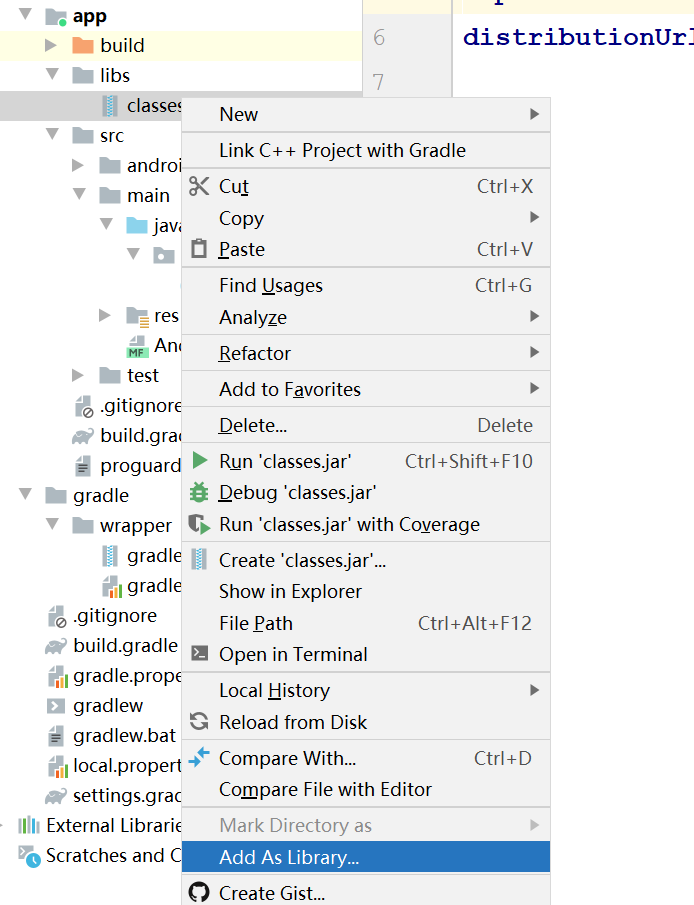
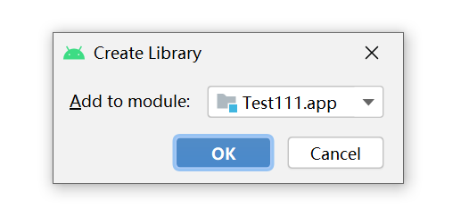
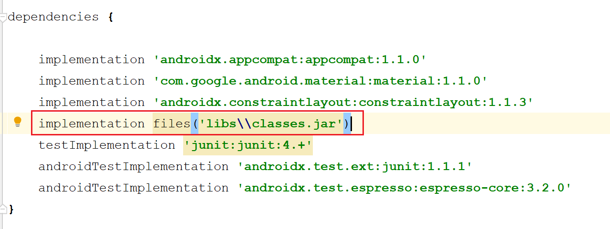
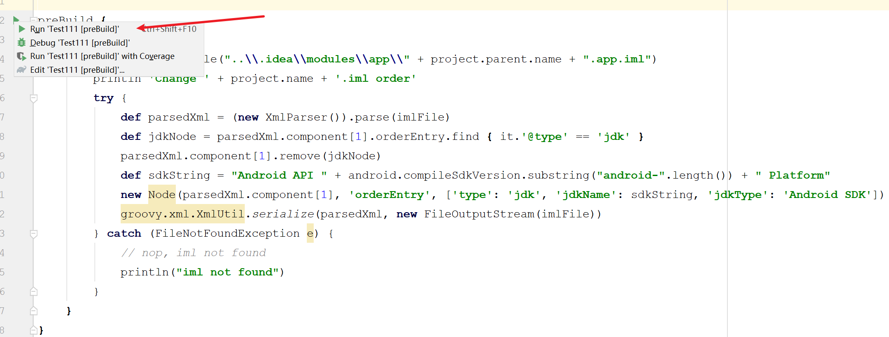
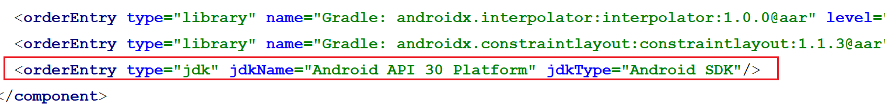

##Android Studio引入framework jar包
####使用环境
* JDK1.8
* Android Studio版本4.13
* gradle-6.5-bin.zip
####导入Jar包
* 首先将framework.jar拷贝到项目的/libs文件夹中，然后右键framework.jar文件，然后Add as Library。


* app目录下的build.gradle中会增加如下

####更换framework.jar优先顺序
* 这里需要用到网上写的一段代码加在app目录下的build.gradle中，如下
``` java
preBuild {
    doLast {
        def imlFile = file("..\\.idea\\modules\\app\\" + project.parent.name + ".app.iml")
        println 'Change ' + project.name + '.iml order'
        try {
            def parsedXml = (new XmlParser()).parse(imlFile)
            def jdkNode = parsedXml.component[1].orderEntry.find { it.'@type' == 'jdk' }
            parsedXml.component[1].remove(jdkNode)
            def sdkString = "Android API " + android.compileSdkVersion.substring("android-".length()) + " Platform"
            new Node(parsedXml.component[1], 'orderEntry', ['type': 'jdk', 'jdkName': sdkString, 'jdkType': 'Android SDK'])
            groovy.xml.XmlUtil.serialize(parsedXml, new FileOutputStream(imlFile))
        } catch (FileNotFoundException e) {
            // nop, iml not found
            println("iml not found")
        }
    }
}
```
* 点击运行，查看项目对应的.iml文件，最终移到最后即可；


####修改root/build.gradle
``` java
allprojects {
    repositories {
        google()
        jcenter()
    }
//add start
    gradle.projectsEvaluated {
        tasks.withType(JavaCompile) {
            options.compilerArgs.add('-Xbootclasspath/p:app//libs//classes.jar')
        }
    }
//add end
}
```
####注意
* Android Studio不同的版本.iml文件的位置不同，注意添加代码的路径。
* 不修改root/build.gradle,工程不会报错，但是无法运行，提示覆盖或已过时。
