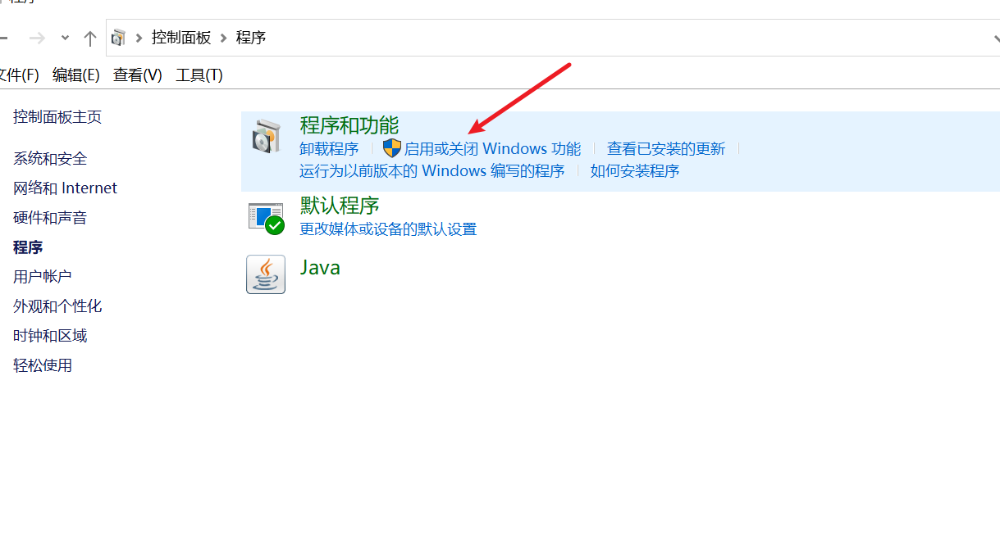
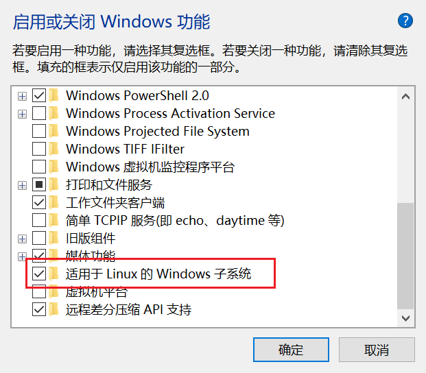
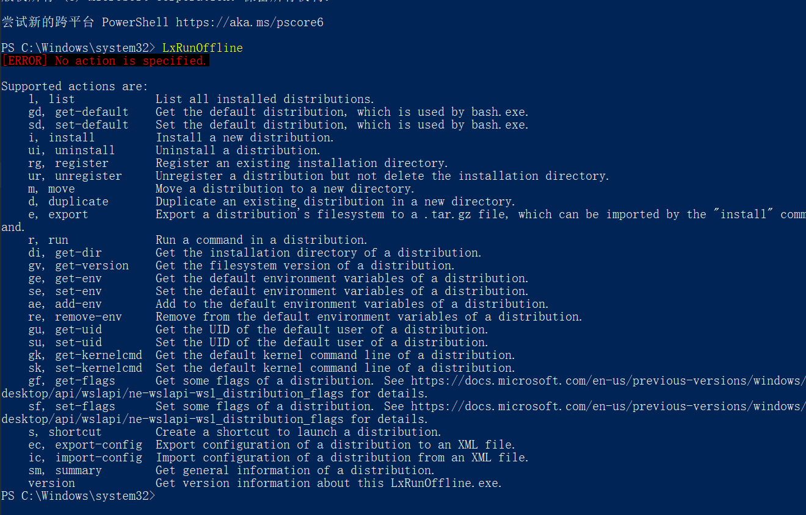
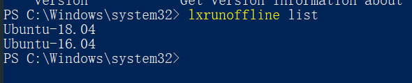
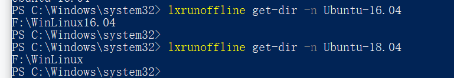
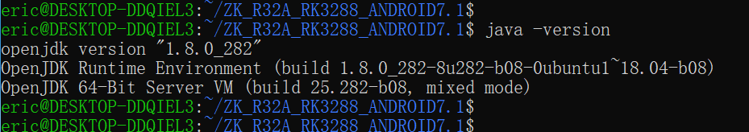
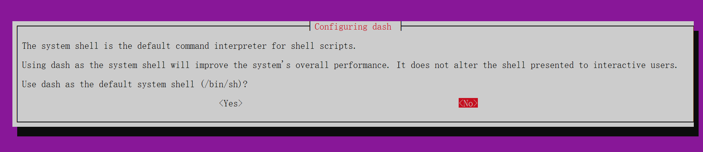

###Ubuntu 16.04 编译 Android 7.1
* RK3399 Android 7.1源码
* win10 子系统 linux ubuntu16.04
* LG笔记本 i7-1165g7
###前言
    一直都用的是公司的服务器，最近想在自己的笔记本上搭建编译环境，主要想平时也能提高一下自己，纠结是用虚拟机还是win10自带的子系统ubuntu，研究了几天，终于成功的搭建环境，并且编译成功。
###ubuntu的下载
1.首先找到控制面板中的程序和功能的启动或者关闭Windows功能，勾选“适用于linux的Windows子系统”，然后重启电脑；


2.打开自带win商店，输入ubuntu，选择需要的版本；

3.这里如何找不到ubuntu16.04版本，点击如下链接
https://www.microsoft.com/zh-cn/p/ubuntu-1604-lts/9pjn388hp8c9?activetab=pivot:overviewtab
4.下载完成之后，就自动安装了，在开始菜单中找到并打开；
###Ubuntu迁移
    由于ubuntu默认是安装在C盘的，而且时间越久占用的空间就越多，所以我们接下来就把它迁移到其他盘符，避免影响系统盘；
* 下载LxRunOffline工具，这个是用来迁移的脚本，链接如下：
https://github.com/DDoSolitary/LxRunOffline/releases
* 解压之后，配置LxRunOffline目录到环境变量path中；
* 打开powerShell，如下图即为成功安装；

* 查看已安装的Linux发行版本： lxrunoffline list  这里我安装了两个版本

* 迁移Linux文件(Ubuntu是我安装的Linux发行版本)
  ``` lxrunoffline move -n Ubuntu-18.04 -d F:\Ubuntu ```
* 确认是否迁移成功；

###Android 7.1 编译环境
#####配置软件源
1. 我这里使用的阿里的源：
``` c
cp /etc/apt/sources.list /etc/apt/sources.list.ubuntun
vim /etc/apt/sources.list
```
2. 输入对应的源地址，保存退出即可：
```
deb http://mirrors.aliyun.com/ubuntu/ bionic main restricted universe multiverse
deb-src http://mirrors.aliyun.com/ubuntu/ bionic main restricted universe multiverse

deb http://mirrors.aliyun.com/ubuntu/ bionic-security main restricted universe multiverse
deb-src http://mirrors.aliyun.com/ubuntu/ bionic-security main restricted universe multiverse

deb http://mirrors.aliyun.com/ubuntu/ bionic-updates main restricted universe multiverse
deb-src http://mirrors.aliyun.com/ubuntu/ bionic-updates main restricted universe multiverse

deb http://mirrors.aliyun.com/ubuntu/ bionic-proposed main restricted universe multiverse
deb-src http://mirrors.aliyun.com/ubuntu/ bionic-proposed main restricted universe multiverse

deb http://mirrors.aliyun.com/ubuntu/ bionic-backports main restricted universe multiverse
deb-src http://mirrors.aliyun.com/ubuntu/ bionic-backports main restricted universe multiverse
# libncurses5-dev lib32ncurses5-dev用到
deb http://ftp.cuhk.edu.hk/pub/Linux/ubuntu xenial main universe
deb-src http://ftp.cuhk.edu.hk/pub/Linux/ubuntu xenial main universe
```
3. 使用阿里源更新ubuntu的软件
```
sudo apt update
```
#####Android 7.1编译环境
1. 安装openjdk-8-jdk
```
sudo apt-get install openjdk-8-jdk
sudo update-alternatives --config java
sudo update-alternatives --config javac
```
2. 查看java的版本,如下安装成功；

3. 安装一些编译需要的工具
```
sudo apt-get install git-core gnupg flex bison gperf build-essential zip curl zlib1g-dev gcc-multilib g++-multilib libc6-dev-i386 lib32ncurses5-dev x11proto-core-dev libx11-dev lib32z-dev libgl1-mesa-dev libxml2-utils xsltproc unzip
```
#####编译遇到的问题(1)
```
arch/arm/boot/compressed/Makefile:180: recipe for target 'arch/arm/boot/compressed/piggy.lzo' failed
make[2]: *** [arch/arm/boot/compressed/piggy.lzo] Error 1
arch/arm/boot/Makefile:52: recipe for target 'arch/arm/boot/compressed/vmlinux' failed
make[1]: *** [arch/arm/boot/compressed/vmlinux] Error 2
arch/arm/Makefile:316: recipe for target 'zImage' failed
make: *** [zImage] Error 2
```
解决办法
```
sudo apt-get install lzop
```
#####编译遇到的问题(2)
报错：win10 WSL下 cannot execute binary file: Exec format error
解决办法：
主要原因是不支持32位程序，可以用如下方法启用：
WSL默认使用64bit的程序，不支持32位的程序，但我们仍然可以使用QEMU来虚拟化内核。
安装QEMU
```
sudo apt update
sudo apt install qemu-user-static
sudo update-binfmts --install i386 /usr/bin/qemu-i386-static --magic '\x7fELF\x01\x01\x01\x03\x00\x00\x00\x00\x00\x00\x00\x00\x03\x00\x03\x00\x01\x00\x00\x00' --mask '\xff\xff\xff\xff\xff\xff\xff\xfc\xff\xff\xff\xff\xff\xff\xff\xff\xf8\xff\xff\xff\xff\xff\xff\xff'
```
启动服务,注意每次调试32位程序之前都要启用一次（可添加到自启）
```
sudo service binfmt-support start
```
若上述安装出现问题，则先执行如下：
```
sudo dpkg --add-architecture i386
sudo apt update
sudo apt-get install libc6:i386 libncurses5:i386 libstdc++6:i386
```
添加为自启服务
```
update-rc.d binfmt-support defaults
```
查看服务状态
```
systemctl is-enabled binfmt-support.service
```
#####编译遇到的问题(3)
报错：Syntax error: "(" unexpected（linux系统）
造成的原因：
代码对于标准bash而言没有错，因为Ubuntu/Debian为了加快开机速度，用dash代替了传统的bash，是dash在捣鬼，解决方法就是取消dash
解决方法：
```
sudo dpkg-reconfigure dash
```
选择No即可；

#####编译遇到的问题(4)
报错：ftruncate(fd_out, GetSize()): Invalid argument
```
[ 45% 37395/82723] Generating TOC: out/target/common/obj/JAVA_LIBRARIES/sdk_v9_intermediates/classes.jar.toc
FAILED: out/target/common/obj/JAVA_LIBRARIES/sdk_v9_intermediates/classes.jar.toc
/bin/bash -c "(ASAN_OPTIONS=detect_leaks=0 prebuilts/build-tools/linux-x86/bin/ijar out/target/common/obj/JAVA_LIBRARIES/sdk_v9_intermediates/classes.jar out/target/common/obj/JAVA_LIBRARIES/sdk_v9_intermediates/classes.jar.toc.tmp ) && (if cmp -s out/target/common/obj/JAVA_LIBRARIES/sdk_v9_intermediates/classes.jar.toc.tmp out/target/common/obj/JAVA_LIBRARIES/sdk_v9_intermediates/classes.jar.toc ; then rm out/target/common/obj/JAVA_LIBRARIES/sdk_v9_intermediates/classes.jar.toc.tmp ; else mv out/target/common/obj/JAVA_LIBRARIES/sdk_v9_intermediates/classes.jar.toc.tmp out/target/common/obj/JAVA_LIBRARIES/sdk_v9_intermediates/classes.jar.toc ; fi )"
ftruncate(fd_out, GetSize()): Invalid argument
/bin/bash: line 1:  7485 Aborted                 (core dumped) ( ASAN_OPTIONS=detect_leaks=0 prebuilts/build-tools/linux-x86/bin/ijar out/target/common/obj/JAVA_LIBRARIES/sdk_v9_intermediates/classes.jar out/target/common/obj/JAVA_LIBRARIES/sdk_v9_intermediates/classes.jar.toc.tmp )
[ 45% 37418/82723] target Java: core-all (out/target/common/obj/JAVA_LIBRARIES/core-all_intermediates/classes)
ninja: build stopped: subcommand failed.
12:18:11 ninja failed with: exit status 1
```
解决方法：
* 修改对应报错的目录中文件
```
grep -rn "ftruncate(fd_out, GetSize())"  ./
F:\WinLinux16.04\rootfs\home\eric\ZK_R32A_RK3288_ANDROID7.1\build\tools\ijar\zip.cc
```
* 修改zip.cc文件936行
```
if (ftruncate(fd_out, GetSize()) < 0) {
    //  return error("ftruncate(fd_out, GetSize()): %s", strerror(errno));
}
```
* 删除ijar文件重新生成
```
g++ -o ijar classfile.cc zip.cc ijar.cc -lz
```
* 重新配置项目编译环境，编译代码
```
source build/envsetup.sh
lunch 8
make -j8
```
最后编译成功；
#####注意
* 如果关闭ubuntu，电脑的内存并没有减少，在powershell中使用 wsl --shutdown
