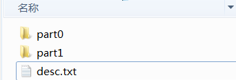
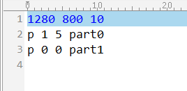
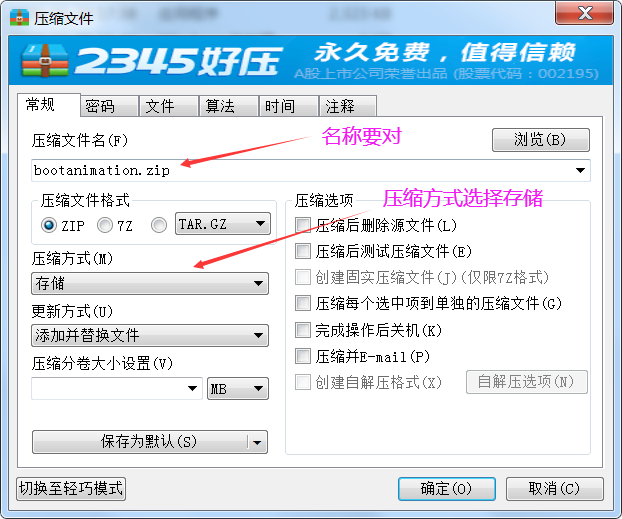

#Bootanimation制作步骤
    CSDN中老罗的一篇开机动画的详细分析写的很好，可以借鉴一下
    http://blog.csdn.net/luoshengyang/article/details/7691321
    这里只讲Android动画的制作步骤；
###动画包的名称路径
    开机动画的名称和路径为：
    bootanimation.zip      /system/media/bootanimation.zip
    关机动画的名称和路径为：
    shutdownanimation.zip  /system/media/shutdownanimation.zip
###动画包的文件解析


    解压出来里面有两个目录一个文件，我们先看desc.txt文件；


    第一行参数： 三个数字分别表示图片的宽度、高度以及帧速(fps);
    第二行参数： p 是开头字符，1表示循环播放一次，5表示循环的间隔fps为单位；part0是对应的目录；
    第三行参数： p 是开头字符，0表示无限循环，0表示循环的间隔fps为单位；part1是对应的目录；
    part0与part1里面存放的就是一系列组成动画的图片，格式可以是jpg，png，bmp等等；
###生成动画压缩包
* 第一方式是windows直接打包

* 第二种方式是利用bat脚本来打包,内容如下；
``` dos
cd C:/Users/Administrator/Desktop/bootanimation/

echo please input Screen resolution !!!

set /p OP1=resolution w:

set /p OP2=resolution h:

echo %OP1% %OP2% 10 > desc.txt

echo p 1 5 part0 >> desc.txt

echo p 0 0 part1 >> desc.txt

sleep 1

WinRAR.exe a -m0 -afzip -r -o+ bootanimation.zip  part0 part1 desc.txt

pasue
```
需要注意的是winRAR.exe需要拷贝到目录中；
