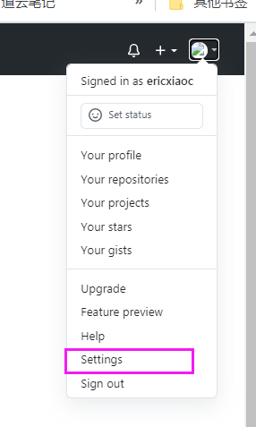
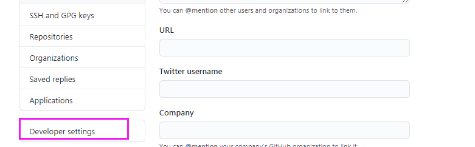
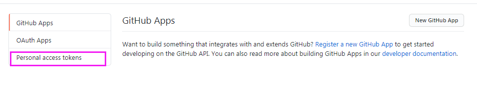
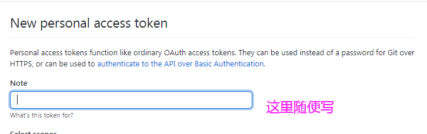
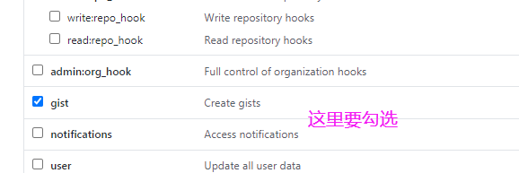
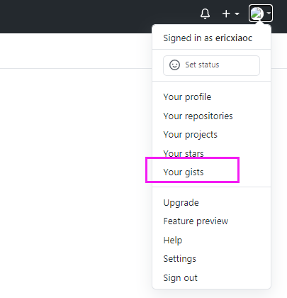
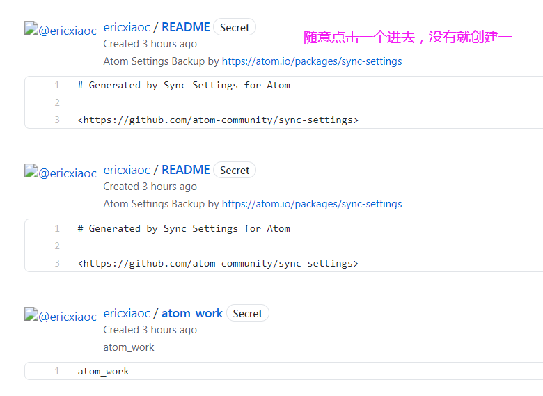
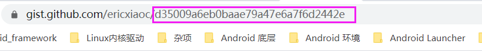
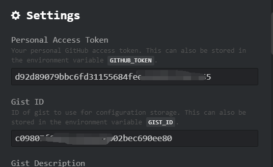

###使用sync-settings插件需要以下3个条件:
* 电脑已安装`Atom`
* Atom内已安装`sync-settings`插件
* 拥有一个GitHub账号（因为需要将同步的信息上传到gits上）
###安装sync-settings插件：
* 在Atom官网下载安装Atom。
* 在Atom中按`Ctrl+Shift+P`调出命令行，输入`install packages`，然后选择第一项。
* 搜索框内输入`sync-settings`并安装，安装完成就需要你输入`token`与`gist ID`。
###获取你的token和Gist id
1. 登录github，点击右上角的头像；
2. 点击Setting中的Developer settings；
3. 点击Personal access tokens创建一个tokens，名字随意取；
###Token获取具体图片流程如下：

最后点击生成，就得到`Personal Access Token`
###gist ID获取具体图片流程如下：

地址上的这一串就是gist ID；
###在Atom中关联token与gist ID
在设置中扩展程序中找到`sync-settings`，并点击设置，如下图

输入完成之后，会自动备份到github，并且在github上会生成相应的文件。
###设置并同步你的Atom设置
上述步骤拿到你的token获Gist id之后，在Atom中按Ctrl+Shift+P调出命令行，输入以下指令以实现你的需求。

代码|功能
--|--
`sync settings:backup`	|备份你的本地Atom的设置到云端
`sync settings:restore`	|从云端恢复你的Atom设置到当前计算机

快捷键`Ctrl+Shift+P`调出命令行，输入`backup`备份到`github`，然后再其他电脑上使用`restore`就可恢复下来。
