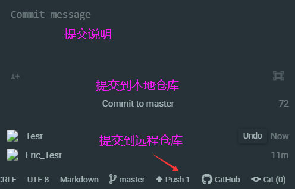

#Atom连接远程仓库（github）
####准备工作
        如果没有github的帐号，请先查看《Atom与github连接并同步》章节，
    Atom-markdown推荐插件先安装好，最后观看该章节。
####git相关命令
    熟悉的朋友，就可以直接跳过该节。
#####git初始化
    git init
#####git添加文件并提交本地
    git add -all   包括新增的文件
    git commit -am "first Atom"
#####git提交到远程github
    git push -u origin master
####新建github项目
* 点击github右上角New repository
* 输入项目名称并且创建
* 创建成功会提示相关命令
具体流程如下图：

####使用windows git Bash建立本地连接
* 创建项目路径
* git Bash中敲上述界面成功的命令
    echo "# Eric_Test" >> README.md
    git init
    git add README.md
    git commit -m "first commit"
    git branch -M main
    git remote add origin https://github.com/ericxiaoc/Eric_Test.git
    git push -u origin main
* 敲完之后，如果没错会弹出对话框让你输入GitHub账号密码，输入即可。
* 然后在Atom里面添加项目目录

* 新建一个文件
* 按快捷键Ctrl+Shift+9会出现git的相关状态

####直接使用Atom的github来关联（推荐，不需要敲命令）
* 添加项目到Atom
* 配置git与github，输入github的帐号密码。

这里的publish失败的话，就先执行一下
`git remote add origin https://github.com/ericxiaoc/Eric_Test.git`
####授权GitHub使用Atom
要在GitHub项目中进行更改 ，您需要为GitHub授权Atom。
* 访问 github.atom.io/login URL并登录到GitHub帐户。
* 复制网址中获取到的token。
* 填写对应的token即可。

#####终于配置环境完成，开始小编之路。
