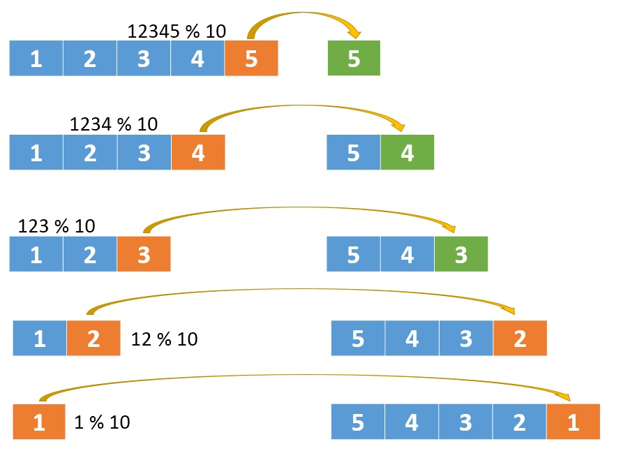
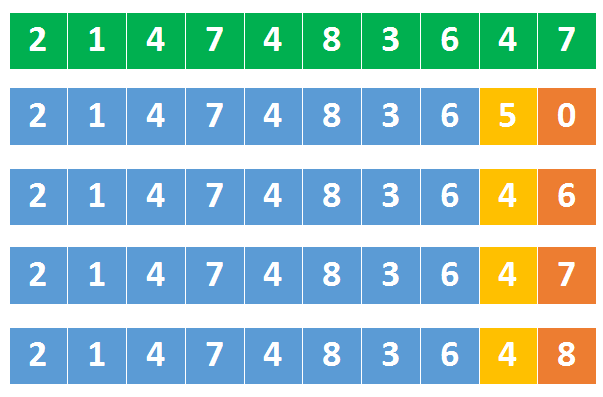
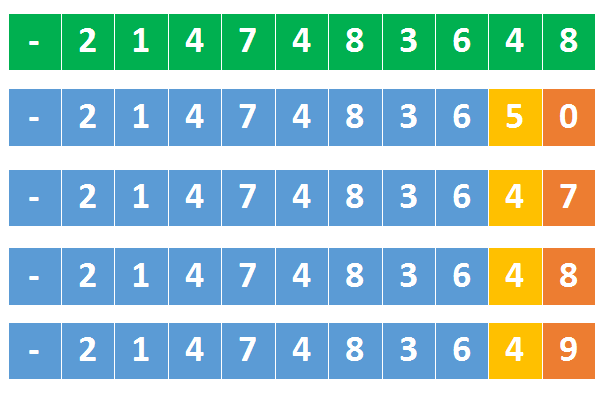

#解题思路
* 首先我们想一下，怎么去反转一个整数？
* 用栈？
* 或者把整数变成字符串，再去反转这个字符串？
* 这两种方式是可以，但并不好。实际上我们只要能拿到这个整数的 末尾数字 就可以了。
* 以12345为例，先拿到5，再拿到4，之后是3，2，1，我们按这样的顺序就可以反向拼接处一个数字了，也就能达到 反转 的效果。
* 怎么拿末尾数字呢？好办，用取模运算就可以了

1. 将12345 % 10 得到5，之后将12345 / 10
2. 将1234 % 10 得到4，再将1234 / 10
3. 将123 % 10 得到3，再将123 / 10
4. 将12 % 10 得到2，再将12 / 10
5. 将1 % 10 得到1，再将1 / 10

这么看起来，一个循环就搞定了，循环的判断条件是x>0
但这样不对，因为忽略了 负数
循环的判断条件应该是while(x!=0)，无论正数还是负数，按照上面不断的/10这样的操作，最后都会变成0，所以判断终止条件就是!=0
有了取模和除法操作，对于像12300这样的数字，也可以完美的解决掉了。

看起来这道题就这么解决了，但请注意，题目上还有这么一句

假设我们的环境只能存储得下 32 位的有符号整数，则其数值范围为 -2^31 ~ 2^31-1

也就是说我们不能用long存储最终结果，而且有些数字可能是合法范围内的数字，但是反转过来就超过范围了。
假设有1147483649这个数字，它是小于最大的32位整数2147483647的，但是将这个数字反转过来后就变成了9463847411，这就比最大的32位整数还要大了，这样的数字是没法存到int里面的，所以肯定要返回0(溢出了)。
甚至，我们还需要提前判断

上图中，绿色的是最大32位整数
第二排数字中，橘子的是5，它是大于上面同位置的4，这就意味着5后跟任何数字，都会比最大32为整数都大。
所以，我们到【最大数的1/10】时，就要开始判断了
如果某个数字大于 214748364那后面就不用再判断了，肯定溢出了。
如果某个数字等于 214748364呢，这对应到上图中第三、第四、第五排的数字，需要要跟最大数的末尾数字比较，如果这个数字比7还大，说明溢出了。

上图中绿色部分是最小的32位整数，同样是在【最小数的 1/10】时开始判断
如果某个数字小于 -214748364说明溢出了
如果某个数字等于 -214748364，还需要跟最小数的末尾比较，即看它是否小于8
