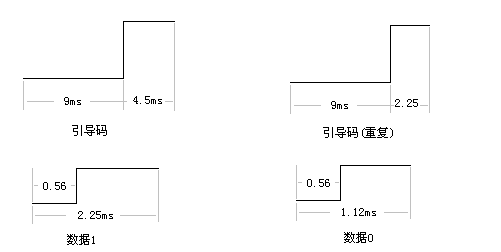
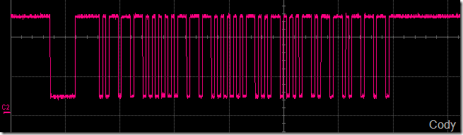
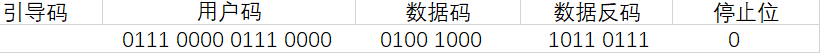
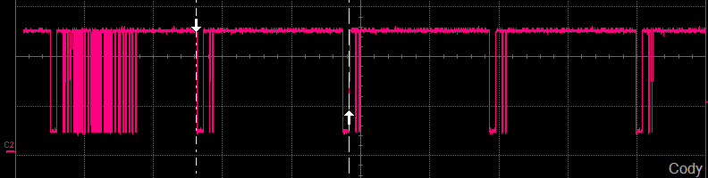

##NEC红外遥控
NEC协议载波：38khz
####红外遥控编码协议
  NEC 编码是比较常见的一种编码协议， 通用红外遥控器发出的一串二进制代码按功能可以分为分「引导码、用户码16位、数据码 8 位、数据反码 8 位和结束位 ]
####红外的波形图

* 下面是按下某个键值的完整波形

解析一下这个波形

``` c
得到的用户码跟码值
usercode = 0x0e0e
datacode = 0x12
```
* 下图是一直按住某个键的波形
当一直按住一个按钮的时候，会隔110ms左右发一次引导码（重复），并不带任何数据

####NEC协议注意
* 协议规定低位首先发送。首先发送9ms+4.5ms的引导码，接下来是两字节用户码，第三字节是数据码，用来判断按键值，第四字节是数据反码，可以用来校验，提高按键的准确性。
* 38Khz载波
* 每位的周期为1.12ms（低电平）或者2.25ms（高电平）
* 数据从LSB（低位）开始发送
* 红外配置的中断脚默认高电平
