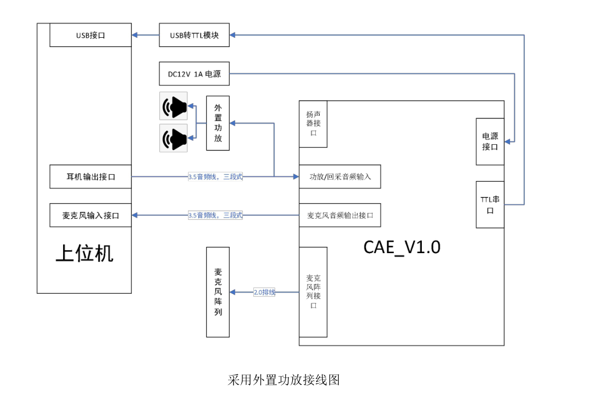

    mic = 麦克：通过麦克收集声音信号。
    line in = 线路输入，通过其他音频设备采集音频信号。
    line out = 线路输出，向其他设备（包括扬声器）输出音频信号。

1. Line in端口：
    该端口主要用于连接电吉他、电子琴、合成器等外界设备的音频信号输出的录音，由于这些设备本身输出功率就比较大，因此需要连接到Line in端口录音，当然使用它们录音从某种程度上也可以被称为外部设备的“内录”。一般您使用的声卡越好，Line in里的噪音就会越低，录制效果也会比较好。
2. Mic in端口：
    这要是连接麦克风录音使用的。但是这个端口和Line in的区别在于它有前置放大器，换言之麦克风本身输出功率小，因此必须要有一个外部的放大设备来放大音频信号。这个端口就是起到这个作用。可以尝试一下把你的麦克风直接连接到Line in端口录音……没有声音或者声音很小对吧？！道理很简单，麦克风的信号没有被放大，自然效果就不好了。
3. 特别要强调的一点是：
    外部的电吉他、合成器这类音频设备万不可直接连接到Mic in上录音，因为这种连接轻则录音时信号会严重削顶失真，重则损毁声卡这类硬件设备！
###如下是常用接线图

