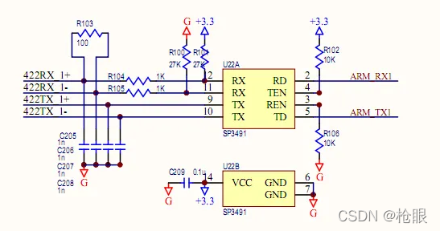

#串口类型区分
* RS232
  * 通讯数据线是2线（RX,TX)，支持全双工通讯
  * 电平值，高电平：-3v ~ -15v；低电平：+3v ~ +15v。
  * 接收，发送，地；三线形成工地的传输模式，容易产生共模干扰；
  * 最大传输距离50英尺，实际上50米左右；
  * 由于电气特性限制，只能是两个设备之间相连，所以只能是点对点双向通信；
  * RS232只能一对多发送，无法同时接收多个；
  * 
* RS422
  - 通讯数据4线方式（TX+,TX-,RX+,RX-），采用单独的发送和接收通道,支持全双工；
  - 电平值，正电平+2~+6v，负电平-2~-6v（TX+和TX-的压差）；它们两者形成“1”或“0”两种状态；
  - 两对双绞线（每对线信号组成T+&R+,T-&R-)，信号地线C，使能端（可用可不用）。对于接收端当T+和T-之间压差大于200mv时是正逻辑电平；小于-200mv时是负逻辑电平。
  - 最大传输距离4000英尺（约1219米），最大传输速率10Mb/s；300米以内通信时可不接终端电阻，超过300米接120欧终端电阻；
  - 由电气特性限制，只能是点对多双向通信，最多可接10个节点（1个主，9个从，从机之间不能通信）。
  - 
* RS485
  - 通讯数据可使用二线和四线；二线只支持半双工，四线时功能与RS422类似。
  - 电平值，正电平+2~+6v，负电平-2~-6v；它们两者形成“1”或“0”两种状态。
  - 一对双绞线A和B，信号地线C，使能端。当AB端之间电平大于200mv时是正逻辑电平；小于- 200mv时是负逻辑电平。这个200mv和-200mv是指AB两条线之间的压差，这个压差主要针对接收器。
  - 最大传输距离4000英尺（约1219米），最大传输速率10Mb/s；300米以内通信时可不接终端电阻，超过300米接120欧终端电阻；
  - 由电气特性限制，二线时可以多点双向通信，可接的设备最多可达32个；
  - 
* 总结
  * RS232，用的比较多的就是两个设备之间的互相通讯。在这次查资资料过程中，还学到了“握手”这个概念，目前还不很清楚用处。后面有需要可以参考：详解RS232、RS485、RS422、串口和握手 - 知乎，由“不脱发的程序猿”分享。
  * RS422，平时用的少，最难懂的就是数据线定义，电平逻辑，接收端+-200mv压差；
  * RS485, 二线485，最难懂的也是AB线的定义，电平逻辑，接收端+-200mv压差等；
