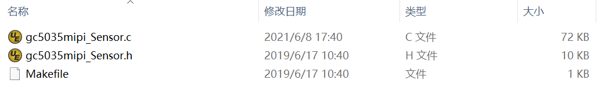
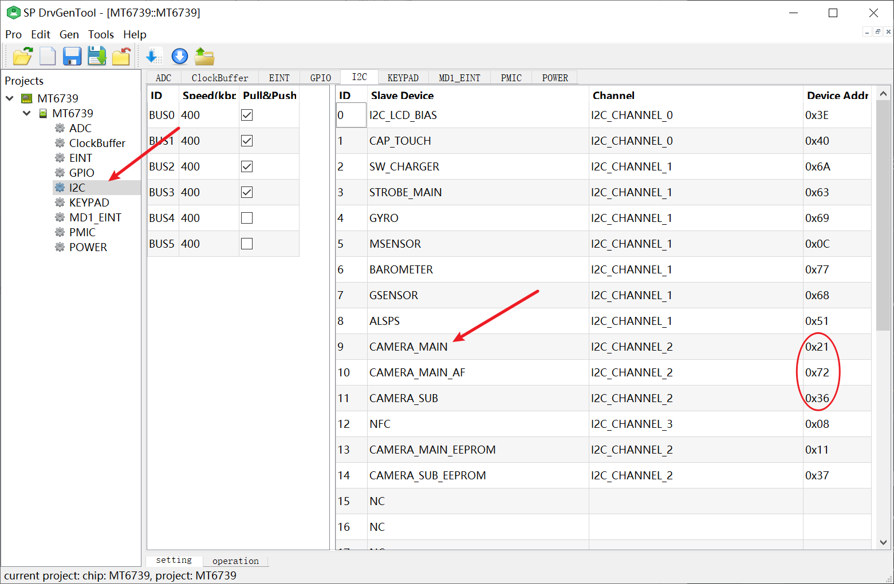
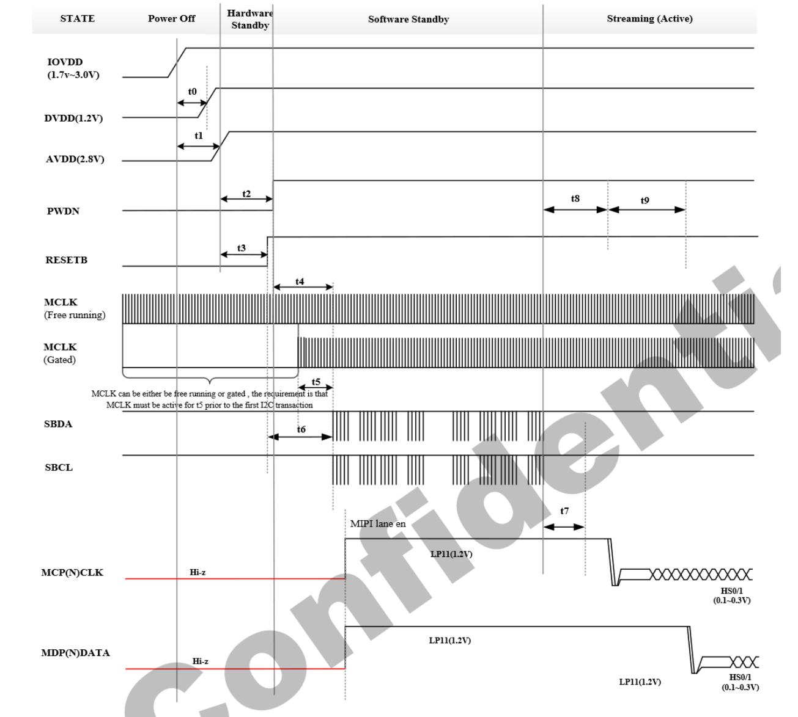
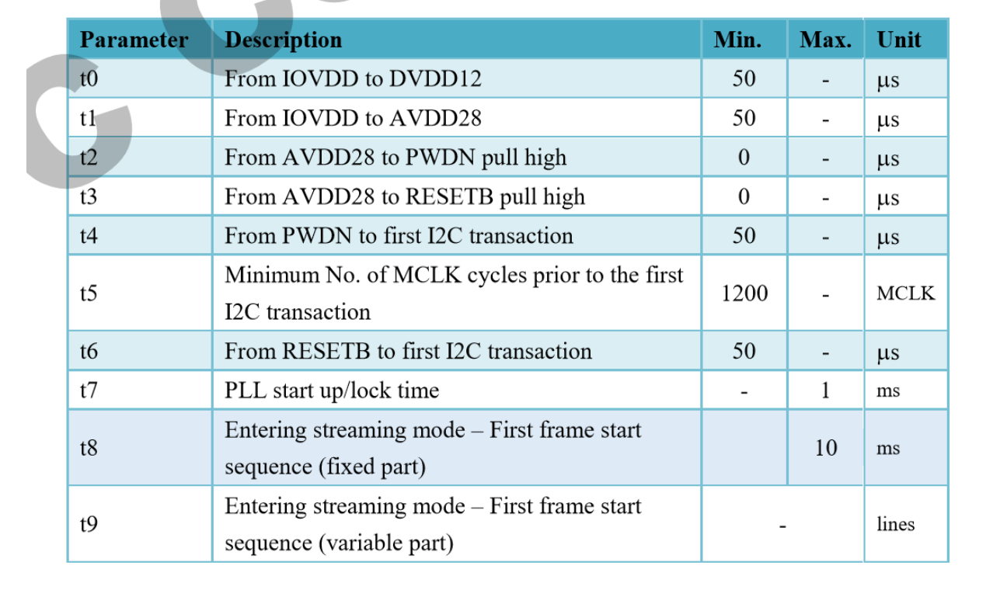

###Android 8.1 新增camera型号
####前言
    平台：MT8765 MT6739
    camera型号： gc5035
####1. 移植HAL层相关文件

* 将```gc5035_mipi_raw```文件夹拷贝到```vendor\mediatek\proprietary\custom\mt6739\hal\imgsensor\ ```目录下
* 将```config.ftbl.gc5035mipiraw.h```文件拷贝到``` \vendor\mediatek\proprietary\custom\mt6739\hal\sendepfeature\gc5035_mipi_raw ```目录下
####2. 配置HAL编译
* 修改ProjectConfig.mk，在没有AF功能，就将全部设置成dummy_lens
``` makefile
/device/mediateksample/a8312/ProjectConfig.mk

CUSTOM_HAL_IMGSENSOR = gc5035_mipi_raw
CUSTOM_HAL_MAIN_BACKUP_LENS = dummy_lens
CUSTOM_HAL_MAIN_IMGSENSOR = gc5035_mipi_raw
CUSTOM_HAL_MAIN_LENS = dummy_lens
CUSTOM_KERNEL_IMGSENSOR = gc5035_mipi_raw
CUSTOM_KERNEL_MAIN_BACKUP_LENS = dummy_lens
CUSTOM_KERNEL_MAIN_IMGSENSOR = gc5035_mipi_raw
CUSTOM_KERNEL_MAIN_LENS = dummy_lens
```
####3. HAL添加新camera支持
* 添加SENSOR_ID 以及DRVNAME，SENSOR_DRVNAME_GC5035_MIPI_RAW要与HAL层新增的```gc5035_mipi_raw```一致。
``` c
device/mediatek/common/kernel-headers/kd_imgsensor.h

#define GC5035_SENSOR_ID                        0x5035
#define SENSOR_DRVNAME_GC5035_MIPI_RAW          "gc5035_mipi_raw"
```
* 将定义的ID与DRVNAME与gc5035中的定义对应,拿到的文件不一定跟系统的配置名相同；
``` c
vendor\mediatek\proprietary\custom\mt6739\hal\imgsensor\gc5035_mipi_raw\camera_info_gc5035mipiraw.h

#define SENSOR_ID                           GC5035_SENSOR_ID //需要一致
#define SENSOR_DRVNAME                      SENSOR_DRVNAME_GC5035_MIPI_RAW//需要一致
```
* 添加到sensor list中,ID与DRVNAME需要保持一致；
``` cpp
/vendor/mediatek/proprietary/custom/a8312/hal/imgsensor_src/sensorlist.cpp
MSDK_SENSOR_INIT_FUNCTION_STRUCT SensorList[] =

#if defined(GC5035_MIPI_RAW)
    RAW_INFO(GC5035_SENSOR_ID, SENSOR_DRVNAME_GC5035_MIPI_RAW,NULL),
#endif
//===========================================================================
/vendor/mediatek/proprietary/custom/mt6739/hal/imgsensor_src/sensorlist.cpp
 MSDK_SENSOR_INIT_FUNCTION_STRUCT SensorList[] =

#if defined(GC5035_MIPI_RAW)
    RAW_INFO(GC5035_SENSOR_ID, SENSOR_DRVNAME_GC5035_MIPI_RAW,NULL),
#endif
```
####4. 移植camera驱动程序


* 将```gc5035_mipi_raw```文件夹拷贝到``` kernel-4.4\drivers\misc\mediatek\imgsensor\src\common\v1```目录下
####5. kernel添加新camera支持
* 修改```a8312_debug_defconfig```和```a8312_defconfig```中配置参数：
``` makefile
CONFIG_CUSTOM_KERNEL_IMGSENSOR="gc5035_mipi_raw"
CONFIG_IMGSENSOR_MAIN="gc5035_mipi_raw"
```
* 添加kernel中的ID与NAME的定义
``` cpp
kernel-4.4/drivers/misc/mediatek/imgsensor/inc/kd_imgsensor.h

#define GC5035_SENSOR_ID                        0x5035
#define SENSOR_DRVNAME_GC5035_MIPI_RAW          "gc5035_mipi_raw"
```
* 声明SENSOR的初始化,注意```GC5035_MIPI_RAW_SensorInit```要与驱动中init方法名一致；
``` cpp
kernel-4.4/drivers/misc/mediatek/imgsensor/src/common/v1/imgsensor_sensor_list.h

UINT32 GC5035_MIPI_RAW_SensorInit(PSENSOR_FUNCTION_STRUCT *pfFunc);
```
* 添加到sensor list中，ID,NAME,Init都需要一致。
``` cpp
kernel-4.4/drivers/misc/mediatek/imgsensor/src/common/v1/imgsensor_sensor_list.c

struct IMGSENSOR_INIT_FUNC_LIST kdSensorList[MAX_NUM_OF_SUPPORT_SENSOR] = {

#if defined(GC5035_MIPI_RAW)
  {GC5035_SENSOR_ID, SENSOR_DRVNAME_GC5035_MIPI_RAW, GC5035_MIPI_RAW_SensorInit},
#endif
```
####6. 查看camera IIC地址以及配置
* 打开```vendor\mediatek\proprietary\scripts\dct```中的DrvGen.exe工具,选择```vendor\mediatek\proprietary\bootable\bootloader\lk\target\a8312\dct\dct\codegen.dws```文件，如下图

查询到camera的对应IIC地址
```
CAMERA_MAIN      ================>  主摄像头
CAMERA_MAIN_AF   ================>  自动对焦的功能
CAMERA_SUB       ================>  副摄像头
```
* 设备树中添加main camera；
``` cpp
&i2c2 {
	#address-cells = <1>;
	#size-cells = <0>;
	clock-frequency = <400000>;

	/*main camera*/
	camera_main@21 {
		compatible = "mediatek,camera_main";
		reg = <0x21>;
	};
};
```
####7. 配置camera上电时序
* 查看时序图


* 修改时序
``` cpp
kernel-4.4/drivers/misc/mediatek/imgsensor/src/mt6739/camera_hw/imgsensor_cfg_table.c

#if defined(GC5035_MIPI_RAW)
  {
    SENSOR_DRVNAME_GC5035_MIPI_RAW,
    {
      {SensorMCLK, Vol_High, 0},
      {PDN, Vol_Low, 5},
      {RST, Vol_Low, 10},
      {DVDD, Vol_1200, 5},
      {DOVDD, Vol_1800, 5},
      {AVDD, Vol_2800, 5},
      {PDN, Vol_High, 5},
      {RST, Vol_High, 5}
    },
  },
#endif
```
