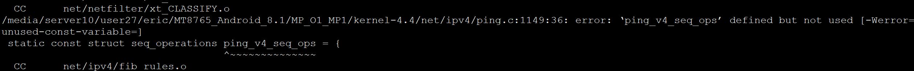

###MTK Android 编译问题
##### 编译出现```cc1:all warnings being treated as errors ```
1. unused-but-set-variable
  
  修改Makefile，设置参数：
  KBUILD_CFLAGS += $(call cc-option,-Wno-unused-but-set-variable)
2. unused-result
  修改Makefile，设置参数：
  KBUILD_CFLAGS += $(call cc-option, -Wno-unused-const-variable)
##### 编译出现
```FAILED: out/soong/.intermediates/system/tools/aidl/libaidl-common/linux_x86_64_static/gen/lex/system```
直接执行一下```export LC_ALL=C```,再次编译即可。
