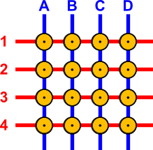
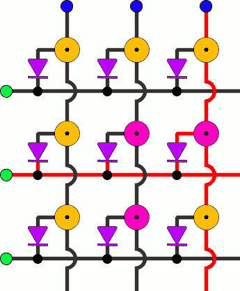
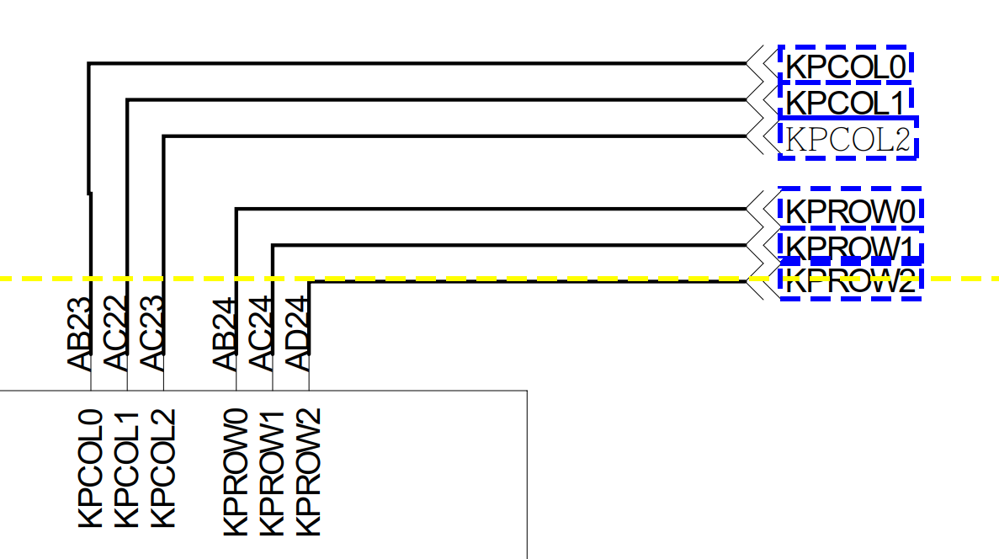
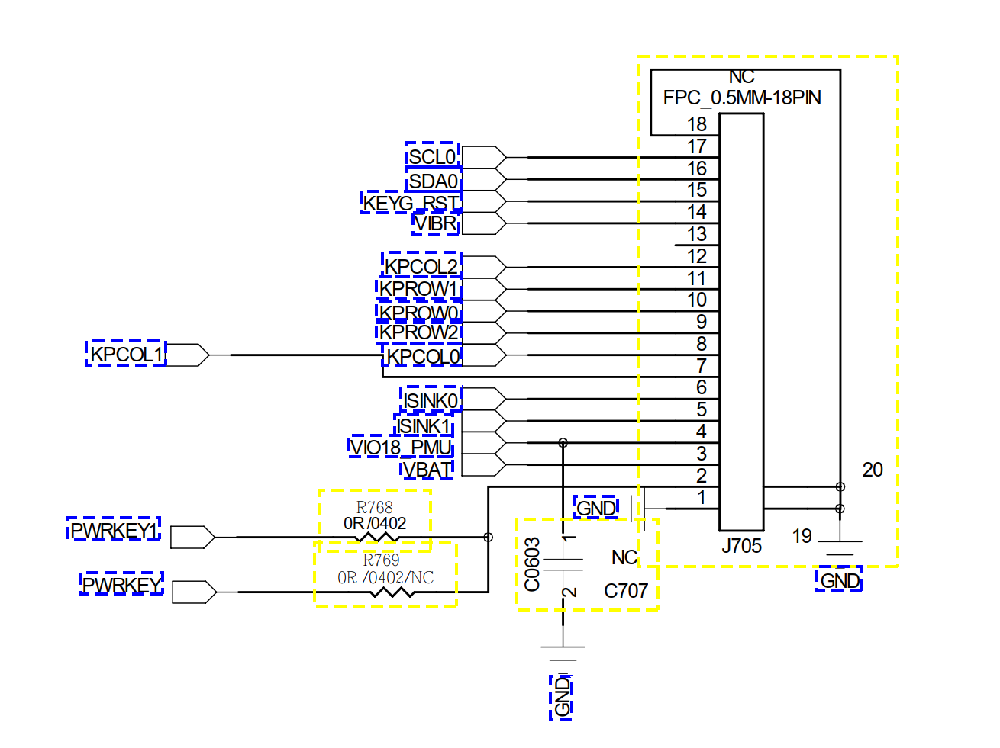
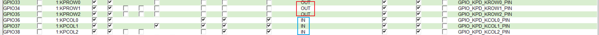
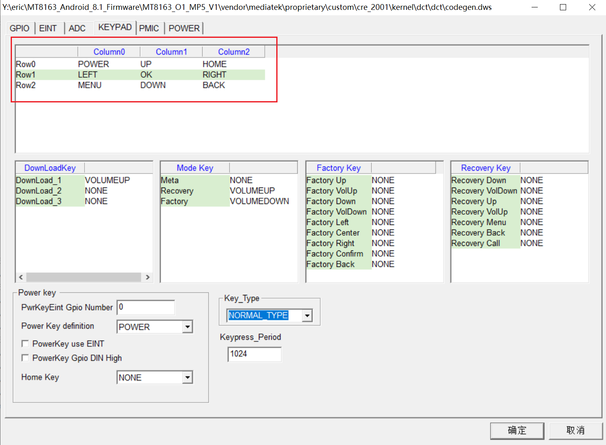

##MTK keypad流程
####keypad基本原理

* col作为输出，row作为输入检测，低电平有效
* col A~D轮流输出低电平，通过rol 1~4上的低电平可以检测是哪个按键按下了
#####存在的问题：
A1，A2，B1同时按下，会造成B2按下的假象，称为鬼影（这3个键导通，colB打开，row2处也会检测到低电平）
#####解决办法：
可以通过增加二极管的方式防止鬼影问题

####keypad IO口的配置
* dws中GPIO设置，mtk将ROW作为输出，COL作为输入检测，preloader的keypad.c文件中对keypad进行了设置
* CPU的三行三列io口,以及按键这边的接口。


* dws中IO的配置要求,以及keypad按键功能的配置，按键里面的功能是在Keypad_YuSu.cmp中定义的。
``` shell
KCOL  : input + pull enable + pull up
KROW  : output + pull disable + pulldown
```


* keypad.c中对按键进行的初始化
``` c
for(i = 0; i < 3; i++)
	{
		if (COL_REG[i] != 0)
		{
			/* KCOL: GPIO INPUT + PULL ENABLE + PULL UP */
			mt_set_gpio_mode(COL_REG[i], ((GPIO_MODE[i] >> 4) & 0x0f));
			mt_set_gpio_dir(COL_REG[i], 0);
			mt_set_gpio_pull_enable(COL_REG[i], 1);
			mt_set_gpio_pull_select(COL_REG[i], 1);
		}

		if (ROW_REG[i] != 0)
		{
			/* KROW: GPIO output + pull disable + pull down */
			mt_set_gpio_mode(ROW_REG[i], (GPIO_MODE[i] & 0x0f));
			mt_set_gpio_dir(ROW_REG[i], 1);
			mt_set_gpio_pull_enable(ROW_REG[i], 0);
			mt_set_gpio_pull_select(ROW_REG[i], 0);
		}
	}
```
####keypad代码分析
* dts的配置分析
``` shell
&keypad {
	mediatek,kpd-key-debounce = <1024>;
	mediatek,kpd-sw-pwrkey = <116>;//电源键
	mediatek,kpd-hw-pwrkey = <8>;
	mediatek,kpd-sw-rstkey  = <114>;
	mediatek,kpd-hw-rstkey = <17>;
	mediatek,kpd-use-extend-type = <0>;
	/*HW Keycode [0~71] -> Linux Keycode*/
	mediatek,kpd-hw-map-num = <72>;
  /*按键的映射 从第0位开始，对应不同的功能，可以从kpd_keymap_handler中读取hw keycode,sw的配置则可以查看mtk-kpd.kl*/
	mediatek,kpd-hw-init-map = <139 105 102 0 0 0 0 0 0 108 28 103 0 0 0 0 0 0 158 106 0 0 0 0
			0 0 0 0 0 0 0 0 0 0 0 0 0 0 0 0 0 0 0 0 0 0 0 0
			0 0 0 0 0 0 0 0 0 0 0 0 0 0 0 0 0 0 0 0 0 0 0 0 >;
	mediatek,kpd-pwrkey-eint-gpio = <0>;
	mediatek,kpd-pwkey-gpio-din  = <0>;
	mediatek,kpd-hw-dl-key0 = <0>;
	mediatek,kpd-hw-dl-key1 = <17>;
	mediatek,kpd-hw-dl-key2 = <8>;
	mediatek,kpd-hw-recovery-key = <17>;
	mediatek,kpd-hw-factory-key  = <0>;
};
```
* 在kpd.c中按键的初始化probe()
``` c
static int kpd_pdrv_probe(struct platform_device *pdev)
{

    int i, r;
    int err = 0;
    struct clk *kpd_clk = NULL;
//获取clk，这里kpd-clk是通过ccf设置的
    kpd_clk = devm_clk_get(&pdev->dev, "kpd-clk");
    if (!IS_ERR(kpd_clk)) {
        int ret_prepare, ret_enable;

        ret_prepare = clk_prepare(kpd_clk);
        if (ret_prepare)
            kpd_print("clk_prepare returned %d\n", ret_prepare);
        ret_enable = clk_enable(kpd_clk);
        if (ret_enable)
            kpd_print("clk_enable returned %d\n", ret_prepare);
    } else {
        kpd_print("get kpd-clk fail, but not return, maybe kpd-clk is set by ccf.\n");
    }
//reg重映射
    kp_base = of_iomap(pdev->dev.of_node, 0);
    if (!kp_base) {
        kpd_info("KP iomap failed\n");
        return -ENODEV;
    };
//irq映射
    kp_irqnr = irq_of_parse_and_map(pdev->dev.of_node, 0);
    if (!kp_irqnr) {
        kpd_info("KP get irqnr failed\n");
        return -ENODEV;
    }
//申请input设备
    kpd_input_dev = input_allocate_device();
    if (!kpd_input_dev) {
        kpd_print("input allocate device fail.\n");
        return -ENOMEM;
    }
//input设备初始化
    kpd_input_dev->name = KPD_NAME;
    kpd_input_dev->id.bustype = BUS_HOST;
    kpd_input_dev->id.vendor = 0x2454;
    kpd_input_dev->id.product = 0x6500;
    kpd_input_dev->id.version = 0x0010;
    kpd_input_dev->open = kpd_open;
//解析dts中keypad节点的信息，赋值给kpd_dts_data结构体
    kpd_get_dts_info(pdev->dev.of_node);
//分配内存空间，用于存放键值和按键状态寄存器
    kpd_memory_setting();
//input设备支持EV_KEY事件
    __set_bit(EV_KEY, kpd_input_dev->evbit);
//powerkey连接PMIC，kpd_keymap[8]设置为空
#if defined(CONFIG_KPD_PWRKEY_USE_EINT) || defined(CONFIG_KPD_PWRKEY_USE_PMIC)
    __set_bit(kpd_dts_data.kpd_sw_pwrkey, kpd_input_dev->keybit);
    kpd_keymap[8] = 0;
#endif
    //powerkey列除[8]外，其余都清空
    if (!kpd_dts_data.kpd_use_extend_type) {
        for (i = 17; i < KPD_NUM_KEYS; i += 9)
        /* only [8] works for Power key */
            kpd_keymap[i] = 0;
    }
    //设置设备支持的键值
    for (i = 0; i < KPD_NUM_KEYS; i++) {
        if (kpd_keymap[i] != 0)
            __set_bit(kpd_keymap[i], kpd_input_dev->keybit);
    }
    //reset按键
    if (kpd_dts_data.kpd_sw_rstkey)
        __set_bit(kpd_dts_data.kpd_sw_rstkey, kpd_input_dev->keybit);

    kpd_input_dev->dev.parent = &pdev->dev;//注册input设备
    r = input_register_device(kpd_input_dev);
    if (r) {
        kpd_info("register input device failed (%d)\n", r);
        input_free_device(kpd_input_dev);
        return r;
    }

    /* register device (/dev/mt6575-kpd) */
    kpd_dev.parent = &pdev->dev;
    r = misc_register(&kpd_dev);
    if (r) {
        kpd_info("register device failed (%d)\n", r);
        input_unregister_device(kpd_input_dev);
        return r;
    }
    //初始化wake_lock
    wake_lock_init(&kpd_suspend_lock, WAKE_LOCK_SUSPEND, "kpd wakelock");

    //设置按键消抖并申请中断处理
    kpd_set_debounce(kpd_dts_data.kpd_key_debounce);
    r = request_irq(kp_irqnr, kpd_irq_handler, IRQF_TRIGGER_NONE, KPD_NAME, NULL);
    if (r) {
        kpd_info("register IRQ failed (%d)\n", r);
        misc_deregister(&kpd_dev);
        input_unregister_device(kpd_input_dev);
        return r;
    }

#ifndef KPD_EARLY_PORTING
 /*add for avoid early porting build err the macro is defined in custom file */
    long_press_reboot_function_setting();
    /* /API 4 for kpd long press reboot function setting */
#endif
    hrtimer_init(&aee_timer, CLOCK_MONOTONIC, HRTIMER_MODE_REL);
    aee_timer.function = aee_timer_func;
    //添加文件属性
    err = kpd_create_attr(&kpd_pdrv.driver);
    if (err) {
        kpd_info("create attr file fail\n");
        kpd_delete_attr(&kpd_pdrv.driver);
        return err;
    }
    kpd_info("%s Done\n", __func__);
    return 0;
}
```
* 中断按键的代码
``` c
static irqreturn_t kpd_irq_handler(int irq, void *dev_id)
{
    //禁止中断，无需进行同步，防止死锁
    disable_irq_nosync(kp_irqnr);
    //调度tasklet
    tasklet_schedule(&kpd_keymap_tasklet);
    return IRQ_HANDLED;
}
//定义tasklet，执行kpd_keymap_handler函数
static DECLARE_TASKLET(kpd_keymap_tasklet, kpd_keymap_handler, 0);

static void kpd_keymap_handler(unsigned long data)
{
    int i, j;
    bool pressed;
    u16 new_state[KPD_NUM_MEMS], change, mask;
    u16 hw_keycode, linux_keycode;
//mtk通过5组寄存器来保存按键的状态，这里回读寄存器并保存为new_state
    kpd_get_keymap_state(new_state);
//激活锁唤醒系统，500ms后就释放掉
    wake_lock_timeout(&kpd_suspend_lock, HZ / 2);

    for (i = 0; i < KPD_NUM_MEMS; i++) {
      //每组中按键状态未改变则对比下一组，按位处理
        change = new_state[i] ^ kpd_keymap_state[i];
        if (!change)
            continue;

        for (j = 0; j < 16; j++) {
          //每组（16位）中对比按位查看是否状态发生改变
            mask = 1U << j;
            if (!(change & mask))
                continue;

            hw_keycode = (i << 4) + j;
            /* bit is 1: not pressed, 0: pressed */
            //按键是否按下，寄存器中0表示按键处于按下状态
            pressed = !(new_state[i] & mask);
            if (kpd_show_hw_keycode)
                kpd_print("(%s) HW keycode = %u\n", pressed ? "pressed" : "released", hw_keycode);
            BUG_ON(hw_keycode >= KPD_NUM_KEYS);
            linux_keycode = kpd_keymap[hw_keycode];
            if (unlikely(linux_keycode == 0)) {
                kpd_print("Linux keycode = 0\n");
                continue;
            }
            kpd_aee_handler(linux_keycode, pressed);
            //上报键值
            input_report_key(kpd_input_dev, linux_keycode, pressed);
            input_sync(kpd_input_dev);
            kpd_print("report Linux keycode = %u\n", linux_keycode);
        }
    }
    //kpd_keymap_state保存new_state，用于下轮对比
    memcpy(kpd_keymap_state, new_state, sizeof(new_state));
    kpd_print("save new keymap state\n");//按键处理完毕，打开中断
    enable_irq(kp_irqnr);
}
```
