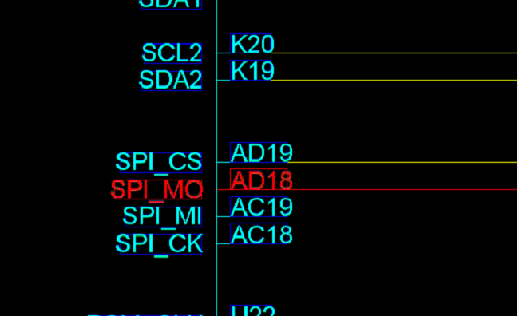
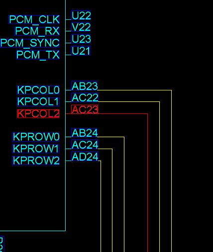

###MTK GPIO控制显示方向

GPIO口为：


AD18 ====> GPIO56 控制不确定，这个功能是跟kernel中功能有冲突的
AC23 ====> GPIO38 控制左右镜像
####LK中显示logo方向
``` c
\vendor\mediatek\proprietary\bootable\bootloader\lk\platform\mt8163\mt_logo.c
#define LCM_DIRECTION_UP_DOWN    			(GPIO56 | 0x80000000)
#define LCM_DIRECTION_LEFT_RIGHT   		(GPIO38 | 0x80000000)

//设置GPIO的状态，
static void lcm_set_gpio_output(unsigned int GPIO, unsigned int output){
	if(GPIO == 0xFFFFFFFF)
		{
		#ifdef BUILD_LK
		printf("[LK/LCM] invalid gpio\n");
		#else
		printk("[LK/LCM] invalid gpio\n");
		#endif
		}
	mt_set_gpio_mode(GPIO, GPIO_MODE_00);
	mt_set_gpio_dir(GPIO, GPIO_DIR_OUT);
	mt_set_gpio_out(GPIO, (output>0)? GPIO_OUT_ONE: GPIO_OUT_ZERO);
}
void init_fb_screen()
{
    dprintf(0, "[lk logo: %s %d]\n",__FUNCTION__,__LINE__);
    unsigned int fb_size = mt_get_fb_size();
    logo_addr = mt_get_logo_db_addr();
//获取在kernel中设置的方向值；
    char* mode = get_env("screen_direction");

    phical_screen.width = CFG_DISPLAY_WIDTH;
    phical_screen.height = CFG_DISPLAY_HEIGHT;
    phical_screen.fb_size = fb_size;
    phical_screen.fill_dst_bits = CFG_DISPLAY_BPP;
		phical_screen.bits_per_pixel = CFG_DISPLAY_BPP;

    // in JB2.MP need to allign width and height to 32 ,but jb5.mp needn't
    phical_screen.needAllign = 1;
    phical_screen.allignWidth = ALIGN_TO(CFG_DISPLAY_WIDTH, MTK_FB_ALIGNMENT);

    /* In GB, no need to adjust 180 showing logo ,for fb driver dealing the change */
    /* but in JB, need adjust it for screen 180 roration           */
    phical_screen.need180Adjust = 1;   // need sync with chip driver

    dprintf(0, "[lk logo: %s %d]MTK_LCM_PHYSICAL_ROTATION = %s\n",__FUNCTION__,__LINE__, MTK_LCM_PHYSICAL_ROTATION);

//根据deconfig中配置的方向来设置显示的方向，
    if(0 == strncmp(MTK_LCM_PHYSICAL_ROTATION, "270", 3))
    {
        phical_screen.rotation = 270;
    } else if(0 == strncmp(MTK_LCM_PHYSICAL_ROTATION, "90", 2)){
        phical_screen.rotation = 90;
    } else if(0 == strncmp(MTK_LCM_PHYSICAL_ROTATION, "180", 3) && (phical_screen.need180Adjust == 1)){
        phical_screen.rotation = 180;
    } else {
        phical_screen.rotation = 0;
    }
//根据kernel中设置的值来初始化对应的方向，保证一致性；
	  if (mode[0] == '0'){
	  	lcm_set_gpio_output(LCM_DIRECTION_UP_DOWN, 1);
			lcm_set_gpio_output(LCM_DIRECTION_LEFT_RIGHT, 0);
			phical_screen.rotation = 0;
			screen_hwrotaton = 0;
	  }else if (mode[0] == '1'){
	  	lcm_set_gpio_output(LCM_DIRECTION_UP_DOWN, 1);
			lcm_set_gpio_output(LCM_DIRECTION_LEFT_RIGHT, 1);
			phical_screen.rotation = 0;
			screen_hwrotaton = 1;
	  }else if (mode[0] == '2'){
	  	lcm_set_gpio_output(LCM_DIRECTION_UP_DOWN, 1);
			lcm_set_gpio_output(LCM_DIRECTION_LEFT_RIGHT, 0);
			phical_screen.rotation = 180;
			screen_hwrotaton = 2;
	  }else if (mode[0] == '3'){
	  	lcm_set_gpio_output(LCM_DIRECTION_UP_DOWN, 1);
			lcm_set_gpio_output(LCM_DIRECTION_LEFT_RIGHT, 1);
			phical_screen.rotation = 180;
			screen_hwrotaton = 3;
	  }else {
	  	//default 值，第一次开机时的方向
	  	lcm_set_gpio_output(LCM_DIRECTION_UP_DOWN, 1);
			lcm_set_gpio_output(LCM_DIRECTION_LEFT_RIGHT, 0);
			phical_screen.rotation = 0;
			screen_hwrotaton = 0;
	  }

  //....
}
```
###Kernel中的logo显示
首先kernel logo显示是在下面目录中，也是通过读取配置的方向来决定方向的。
``` c
vendor\mediatek\proprietary\external\libshowlogo\charging_animation.cpp

int anim_fb_init(void)
{
  //...
  if(0 == strncmp(MTK_LCM_PHYSICAL_ROTATION, "270", 3))
      {
          phical_screen.rotation = 270;
      } else if(0 == strncmp(MTK_LCM_PHYSICAL_ROTATION, "90", 2)){
          phical_screen.rotation = 90;
      } else if(0 == strncmp(MTK_LCM_PHYSICAL_ROTATION, "180", 3) && (phical_screen.need180Adjust == 1)){
          phical_screen.rotation = 180;
      } else {
          phical_screen.rotation = 0;
      }
  //...
}
```
###修改默认屏幕方向
* 修改 device\mediateksample\cre_2001\ProjectConfig.mk
``` makefile
MTK_LCM_PHYSICAL_ROTATION = 0
```
* 修改kernel-3.18\arch\arm64\configs\cre_2001_debug_defconfig
* 修改kernel-3.18\arch\arm64\configs\cre_2001_defconfig
``` makefile
CONFIG_MTK_LCM_PHYSICAL_ROTATION="0"
```
* 修改vendor\mediatek\proprietary\bootable\bootloader\lk\project\cre_2001.mk
``` makefile
MTK_LCM_PHYSICAL_ROTATION = 0
```
###屏幕180翻转,通过硬件OVL来实现
* 修改kernel-3.18\arch\arm64\configs\cre_2001_debug_defconfig
* 修改kernel-3.18\arch\arm64\configs\cre_2001_defconfig
``` makefile
CONFIG_MTK_LCM_PHYSICAL_ROTATION_HW=y
```
* 注意，这里与文章开头的GPIO改变方向的功能是一致的，利用IO口改变方向，与kernel中方向有冲突；
###修改动画方向
* 修改frameworks\base\cmds\bootanimation\BootAnimation.cpp
* 对动画资源本身不作处理，直接修改其显示方向
``` cpp
SurfaceComposerClient::setDisplayProjection(dtoken, DisplayState::eOrientationDefault/*orientation*/, Rect(fakeWidthInt, fakeHeightInt), Rect(realWidthInt, realHeightInt));
```
