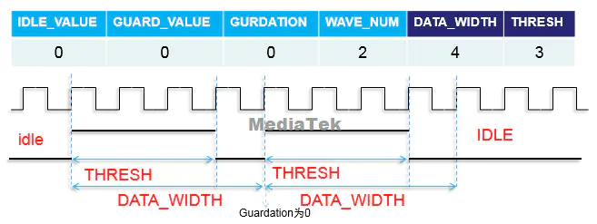
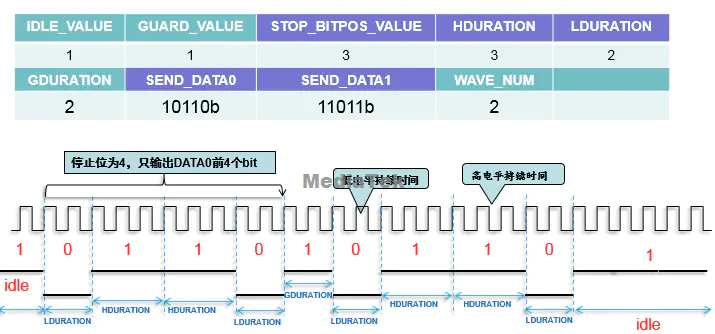
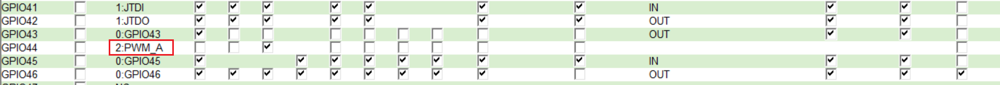

###MTK PWM控制流程
####PWM FIFO配置说明
* 结构体参数
``` c
//for old pwm_mode
struct _PWM_OLDMODE_REGS {
  U16 IDLE_VALUE; //idle状态下的输出电平
  U16 GUARD_VALUE; //guard duration的输出电平
  U16 GDUARTION; //guard duration，即两次完整波形间隔时间
  U16 WAVE_NUM; //输出波形数目，为0则一直传输直到PWM_EN disabled
  U16 DATA_WIDTH; //波形周期宽度
  U16 THRESH; //高电平clk数目
}PWM_MODE_OLD_REGS;

//for fifo mode
struct _PWM_MODE_FIFO_REGS {
  U32 IDLE_VALUE; //idle time输出电平
  U32 GUARD_VALUE; //guard duration输出电平
  U32 STOP_BITPOS_VALUE; //停止位，决定data中输出的bit位数，取值为0~63；
  U16 HDURATION; //高电平持续的base clk数目；
  U16 LDURATION; //低电平持续的base clk数目；
  U32 GDURATION; //两个完整波形间隔时间；
  U32 SEND_DATA0; //32位DATA0数值；
  U32 SEND_DATA1; //32为DATA1数值；
  U32 WAVE_NUM; //输出波形数目，若为0则持续输出；
}PWM_MODE_FIFO_REGS;
```
####输出波形
  old_mode :
  输出频率为 : clk_src/clk_div/DATA_WIDTH
  占空比为 : THRESH/DATA_WIDTH


  fifo_mode :
  FIFO mode下PWM波形是按照两个32位DATA的数值输出高低电平,
  注意HDURATION、LDURATION只对DATA数据生效，GDURATION采用base clk,
  
* 输出计算公式：
  若持续输出，则频率计算公式为：
``` c
fifo_mode:
//频率
freq = clk_src/clk_div/ (DATA高电平数目 * HDURATION + DATA低电平数目 * LDURATION + GDURATION)
//占空比  方波才有占空比
duty = (DATA高电平数目*HDURATION) / (DATA高电平数目*HDURATION + DATA低电平数目*LDURATION + GDURATION), 其中，GUARD_VALUE为1

old_mode:
输出频率为：clk_src/clk_div/DATA_WIDTH
26000/1/133=195MHZ
占空比为:THRESH/DATA_WIDTH
66/133=1/2
```
####正常调用pwm函数操作
``` c
#include <mt-plat/mt_pwm.h>
//for fifo_mode
void gpio_set_pwm(int pwm_num, u32 data)
{
  struct pwm_spec_config pwm_setting;
  pwm_setting.pwm_no = pwm_num;
  pwm_setting.mode = PWM_MODE_FIFO;
  pwm_setting.clk_src = PWM_CLK_NEW_MODE_BLOCK;
  pwm_setting.clk_div = CLK_DIV128;
  pwm_setting.pwm_mode.PWM_MODE_FIFO_REGS.IDLE_VALUE = 0;
  pwm_setting.pwm_mode.PWM_MODE_FIFO_REGS.GUARD_VALUE = 0;
  pwm_setting.pwm_mode.PWM_MODE_FIFO_REGS.STOP_BITPOS_VALUE = 63;
  pwm_setting.pwm_mode.PWM_MODE_FIFO_REGS.HDURATION = 3;
  pwm_setting.pwm_mode.PWM_MODE_FIFO_REGS.LDURATION = 3;
  pwm_setting.pwm_mode.PWM_MODE_FIFO_REGS.GDURATION = 0;
  pwm_setting.pwm_mode.PWM_MODE_FIFO_REGS.WAVE_NUM = 0;
  pwm_setting.pwm_mode.PWM_MODE_FIFO_REGS.SEND_DATA0 = data;
  pwm_setting.pwm_mode.PWM_MODE_FIFO_REGS.SEND_DATA1 = 0x00000000;
  pwm_set_spec_config(&pwm_setting);
}
//for old_mode

void my_set_pwm(int pwm_num)
{
    struct pwm_spec_config pwm_setting;
    memset(&pwm_setting, 0, sizeof(struct pwm_spec_config));
    pwm_setting.pwm_no = pwm_num;
    pwm_setting.mode = PWM_MODE_OLD;
    /* We won't choose 32K to be the clock src of old mode
      because of system performance. */
    /* The setting here will be clock src = 26MHz,
        CLKSEL = 26M/1625 (i.e. 16K) */
    pwm_setting.clk_src = PWM_CLK_OLD_MODE_BLOCK;//(26MHZ)
    pwm_setting.PWM_MODE_OLD_REGS.THRESH = 66;
    pwm_setting.clk_div = CLK_DIV1;//CLK_DIV1 = 1
    pwm_setting.PWM_MODE_OLD_REGS.DATA_WIDTH = 133;
    pwm_setting.PWM_MODE_FIFO_REGS.IDLE_VALUE = 0;
    pwm_setting.PWM_MODE_FIFO_REGS.GUARD_VALUE = 0;
    pwm_setting.PWM_MODE_FIFO_REGS.GDURATION = 0;
    pwm_setting.PWM_MODE_FIFO_REGS.WAVE_NUM = 0;
    pwm_set_spec_config(&pwm_setting);
}
```
####参数说明
``` c
* pwm_no : 是选取需要的PWM number，有PWM0，PWM1，PWM2，PWM3...具体看使用的是哪个pwm。
* mode : 选择PWM_MODE_FIFO,主要有两种模式PWM_MODE_OLD(old mode)和fifo mode。
* clk_src :
  old mode :
  取值只能是PWM_CLK_OLD_MODE_BLOCK(26MHZ)、PWM_CLK_OLD_MODE_32K(32KHZ)。
  fifo mode :
  取值只能是PWM_CLK_NEW_MODE_BLOCK(52MHz)、PWM_CLK_NEW_MODE_DIV_BY_1625(32KHz)。
* clk_div : 分频系数
  CLK_DIV1,CLK_DIV2,CLK_DIV4,CLK_DIV8,CLK_DIV16,CLK_DIV32,CLK_DIV64,CLK_DIV128。
* IDLE_VALUE : false 或者 TRUE，FALSE则波形传输结束后，该GPIO的电平为低，TRUE则波形传输
  结束后，该GPIO的电平为高。
* GUARD_VALID : FALSE 或者TRUE， FALSE则两次完整的波形之间没有间隔时间，TRUE则两次完整
  的波形之间有间隔时间，时间由GDURATION决定。
* GDURATION : 当GUARD_VALID 置1，GDURATION才会生效，表示两次完整波形之间的间隔时间，计
  算公式 :
  T = 1/(clk_src/clk_div) * (GDURATION + 1)
  clk_src选择52MHz，clk_div选择1分频，GDURATION = 1
  T = 1/(52/1) * (1 + 1) = 40ns
* HDURATION和LDURATION：分别表示高电平和低电平的持续时间，计算公式 :
  T = 1/(clk_src/clk_div) * (HDURATION + 1)
  T = 1/(clk_src/clk_div) * (LDURATION + 1)
  clk_src选择52MHz，clk_div选择1分频，HDURATION = 1, LDURATION =1,
  T = 1/(52/1) * (1 + 1) = 40ns
* STOP_BITPOS_VALUE : 是FIFO MODE中send_data0和send_data1在实际传输时的停止位，最大值为
  63 (因为最多传输64bits)
* send_data0和send_data1：是传输的波形的数据，转化成二进制整数以后，1代表高电平，0代
  表低电平。
* wave_num : 为波形传输的次数，如果值为0那么只有disable pwm的时候会停止波形传输。
```
#### 1khz例子
``` c
pwm_setting.pwm_no = 1;
pwm_setting.mode = PWM_MODE_FIFO;
pwm_setting.clk_src = PWM_CLK_NEW_MODE_BLOCK;//52MHz
pwm_setting.clk_div = CLK_DIV128; // 52MHz/128
pwm_setting.PWM_MODE_FIFO_REGS.IDLE_VALUE = 0；
pwm_setting.PWM_MODE_FIFO_REGS.GUARD_VALID = 0;
pwm_setting.PWM_MODE_FIFO_REGS.STOP_BITPOS_VALUE = 63; // 52MHz/128/64
pwm_setting.PWM_MODE_FIFO_REGS.HDURATION = 3;
pwm_setting.PWM_MODE_FIFO_REGS.LDURATION = 3; // 52MHz/128/64/(3+3)1KHz
pwm_setting.PWM_MODE_FIFO_REGS.GDURATION = 0;
pwm_setting.PWM_MODE_FIFO_REGS.WAVE_NUM = 0;
pwm_setting.PWM_MODE_FIFO_REGS.SEND_DATA0 = 0xFFFFFFFF; // duty is 50%
pwm_setting.PWM_MODE_FIFO_REGS.SEND_DATA1 = 0x00000000;
pwm_set_SPEC_config(&pwm_setting);

/*
根据公式计算：
freqp = clk_src/clk_div/ (DATA高电平数目 * HDURATION + DATA低电平数目 * LDURATION + GDURATION)
freq = 52MHz / 128 / (data最多64bit) / (3 (HDURATION) + 3 (LDURATION))  ≈ 1.0khz
 */
```
####MTK PWM背光调用流程
#####dws配置

这里使用GPIO44，设置默认模式为PWM_A，这里的A代表0,
PWM_A 对应的pwm_no=0
PWM_B 对应的pwm_no=1
PWM_C 对应的pwm_no=2
#####dts配置方式
``` c
led6:led@6 {
  compatible = "mediatek,lcd-backlight";
  led_mode = <5>;
  data = <1>;
  pwm_config = <0 0 0 0 0>;
};
```
pwm_config参数 : clock source、divider、low_duration、high_duration、pmic_pad，与dts配置中pwm_config = <0 0 0 0 0>参数一一对应。
如上设定：clock source=26MHz，divider=0
freq=26MHz/1/1024=25.29KHz
