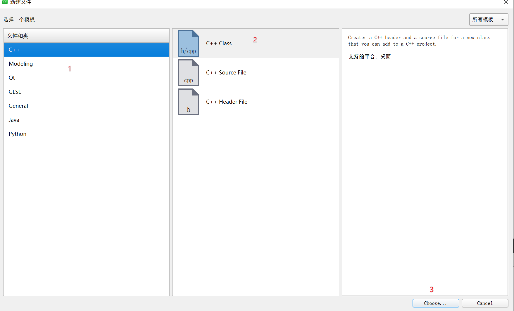
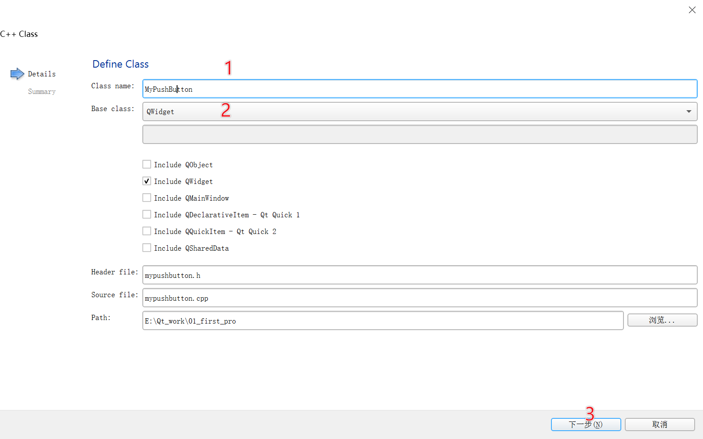

##Qt自定义按钮
######创建自定义按钮程序


``` cpp
//mypushbutton.cpp

#include "mypushbutton.h"
#include <QDebug>

MyPushButton::MyPushButton(QWidget *parent) : QPushButton(parent)
{
    qDebug() << "我的自定义按钮";//添加打印调时打印信息
}

MyPushButton::~MyPushButton(){
    qDebug() << "我的自定义按钮析构";//添加释放时的打印信息
}

//mypushbutton.h
#ifndef MYPUSHBUTTON_H
#define MYPUSHBUTTON_H

#include <QPushButton>

class MyPushButton : public QPushButton
{
    Q_OBJECT
public:
    explicit MyPushButton(QWidget *parent = nullptr);
    ~MyPushButton();//添加析构函数

signals:

public slots:
};

#endif // MYPUSHBUTTON_H

//mywidget.cpp 中调用自定义按钮类
#include "mywidget.h"
#include <QPushButton>//按钮的头文件
#include "mypushbutton.h"//自定义按钮头文件
#include <QDebug> //打印信息包含的头文件

myWidget::myWidget(QWidget *parent)
    : QWidget(parent)
{
     //自定义按钮
     MyPushButton * mybtn = new MyPushButton;
     //设置标题
     mybtn->setText("自定义窗口");
     //移动窗口
     mybtn->move(200,200);
     //设置到对象树中
     mybtn->setParent(this);
}

myWidget::~myWidget()
{

}

```
