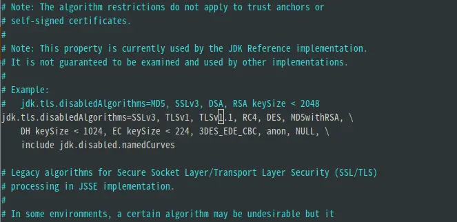

###Android 8.1 编译过程中Jack server SSL error 错误解决方法
 使用的环境是ubuntu 18.04 编译大概率会出现jack server 跑不起来然后抛一个类似这样的错误
 ``` shell
 [ 10% 538/4980] Ensuring Jack server is installed and started
FAILED: setup-jack-server
/bin/bash -c "(prebuilts/sdk/tools/jack-admin install-server prebuilts/sdk/tools/jack-launcher.jar prebuilts/sdk/tools/jack-server-4.11.ALPHA.jar  2>&1 || (exit 0) ) && (JACK_SERVER_VM_ARGUMENTS=\"-Dfile.encoding=UTF-8 -XX:+TieredCompilation\" prebuilts/sdk/tools/jack-admin start-server 2>&1 || exit 0 ) && (prebuilts/sdk/tools/jack-admin update server prebuilts/sdk/tools/jack-server-4.11.ALPHA.jar 4.11.ALPHA 2>&1 || exit 0 ) && (prebuilts/sdk/tools/jack-admin update jack prebuilts/sdk/tools/jacks/jack-4.32.CANDIDATE.jar 4.32.CANDIDATE || exit 47 )"
Jack server already installed in "/home/user/.jack-server"
Communication error with Jack server (35), try 'jack-diagnose' or see Jack server log
SSL error when connecting to the Jack server. Try 'jack-diagnose'
SSL error when connecting to the Jack server. Try 'jack-diagnose'
[ 10% 541/4980] build out/target/product/rk3399_mid/obj/ETC/precompiled_sepolicy_intermediates/precompiled_sepolicy
ninja: build stopped: subcommand failed.
22:32:18 ninja failed with: exit status 1

build completed failed
 ```
 原因就是编译时用的是open-jdk 8u292，默认禁用了TLSv1, TLSv1.1，
从/etc/java-8-openjdk/security/java.security中取消TLSv1, TLSv1.1 禁用，
修改前:

修改后:
```
jdk.tls.disabledAlgorithms=SSLv3, RC4, DES, MD5withRSA, \
    DH keySize < 1024, EC keySize < 224, 3DES_EDE_CBC, anon, NULL, \
    include jdk.disabled.namedCurves
```
/prebuilts/sdk/tools/ 目录下执行
``` ./jack-admin kill-server && ./jack-admin start-server ```
成功。
