###GitBlit搭建局域网git服务器
####gitblit安装
* 官网下载(http://www.gitblit.com/)最新版本，这里我下载的是1.9.1版本
* 打开下载的目录，如下图，先进入data目录配置参数，可以看到defaults.properties这个文件，修改其中的server.httpPort端口号，这里我改的是8686；
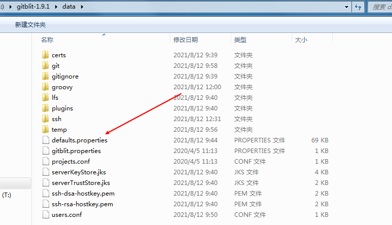
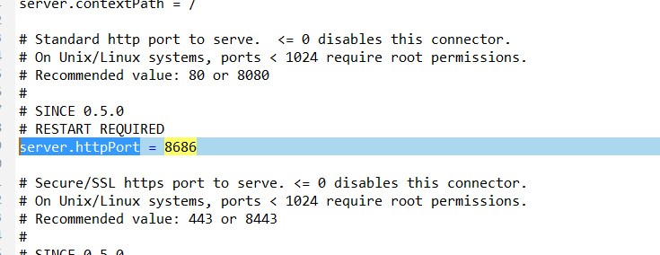
* 回到跟目录，开始安装，双击```gitblit.cmd```，出现如下图的界面就ok了；
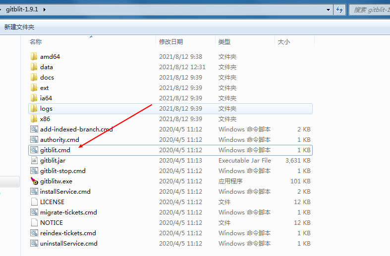
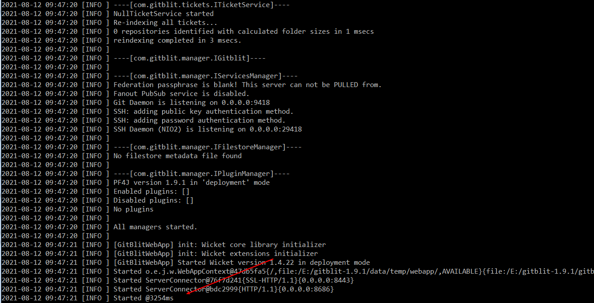
* 浏览器中输入本机IP地址加上面修改的端口号```https://192.168.12.230:8686 ```。
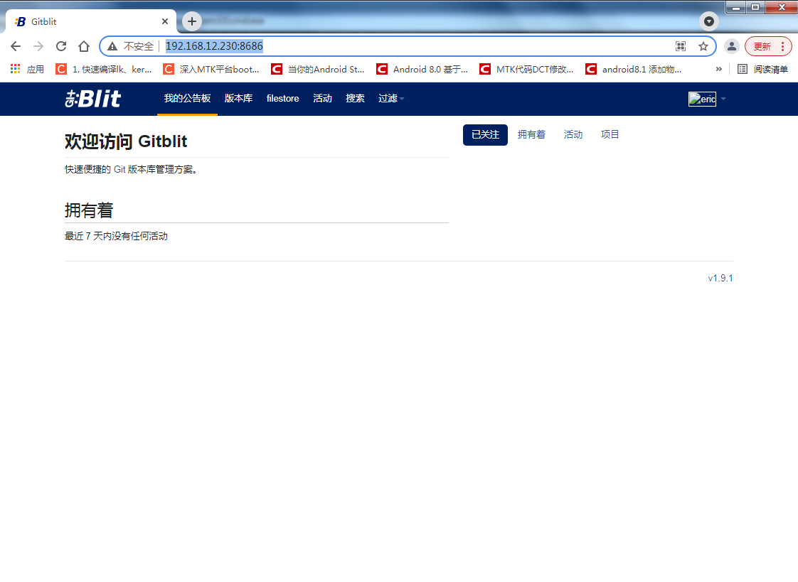
####添加gitblit服务到系统
* 可以运行```installService.cmd```，把它加入Windows服务中，可以看到执行后同时也生成了```uninstallService.cmd```文件，用于卸载服务
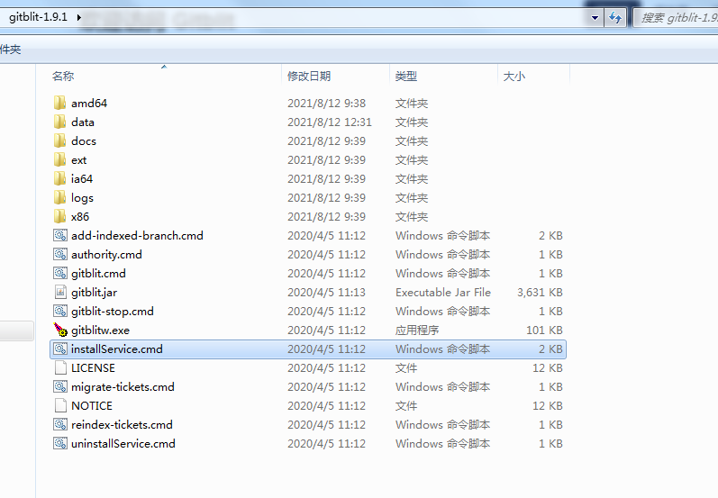
####创建bitblit版本库
* 登录帐号，并创建自己的帐号；默认登录帐号admin 密码admin；
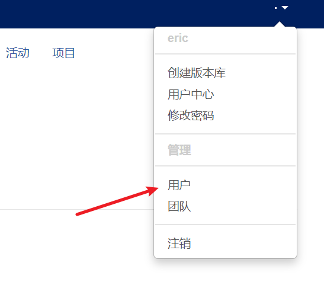
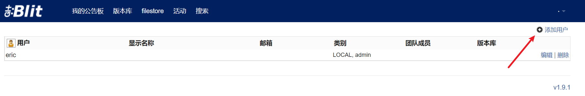
* 创建一个版本库
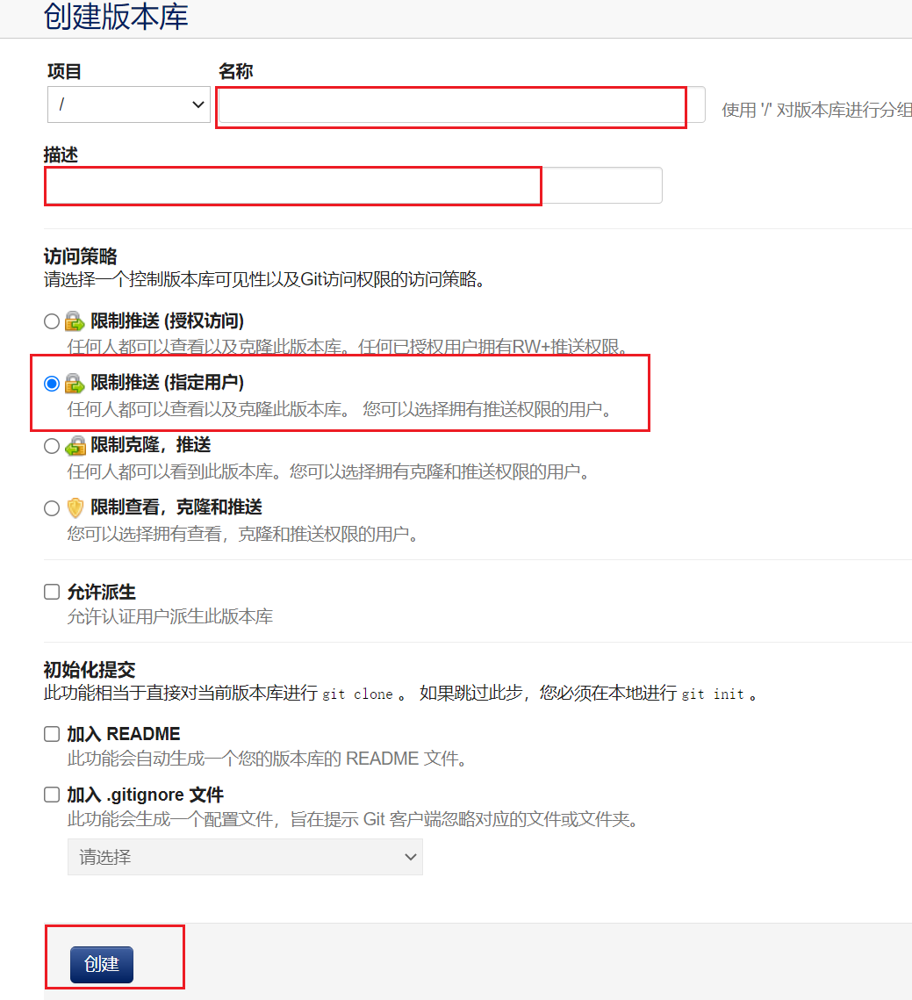
####将本地项目上传到版本库中
``` shell
#初始化一个空的git
git init
#添加当前目录所有文件到git缓存区
git add --all
#提交到本地仓库
git commit -am "20210812 1.初始化第一个版本"
#添加远程仓库的地址
git remote add origin http://eric@192.168.12.230:8686/r/mt8385_android_p.git
#push项目到远程服务器
git push origin master
```
####查看远程仓库克隆地址
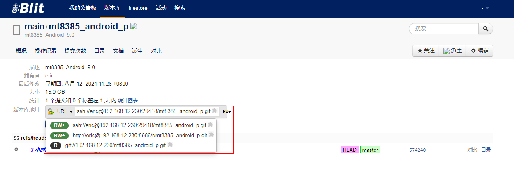
####遇到的问题
* linux kernel 源码提交到gitblit报错解决办法
``` shell
fatal: Will not add file alias 'kernel/include/uapi/linux/netfilter/xt_connmark.h' ('kernel/include/uapi/linux/netfilter/xt_CONNMARK.h' already exists in index)
```
解决办法：
``` shell
#设置git对大小写不敏感：
git config core.ignorecase false
```
* push项目到远程服务器时，验证不通过
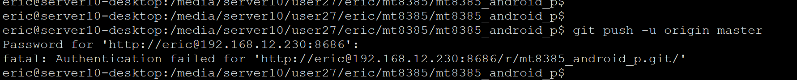
解决办法：
``` shell
sudo git config --system --unset credential.helper
```
* add remote 版本库的ssh地址，无法push，更换成https即可；
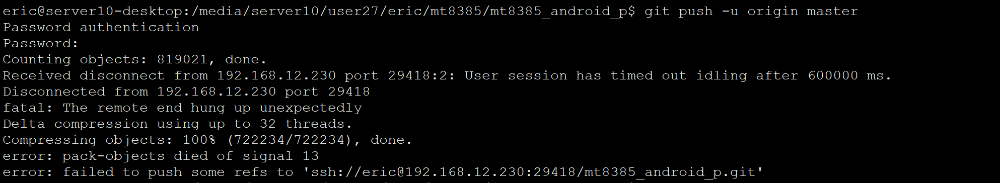
解决办法：
``` shell
git remote -v
git remote remove origin
git remote add origin http://eric@192.168.12.230:8686/r/mt8385_android_p.git
```
####局域网内其他人协同开发
如果需要多个用户来登录gitblit，就需要设置一下防火墙的相关设置；
* 打开"控制面板"-->"管理工具"-->"高级安全Windows Defender 防火墙"，如图所示：
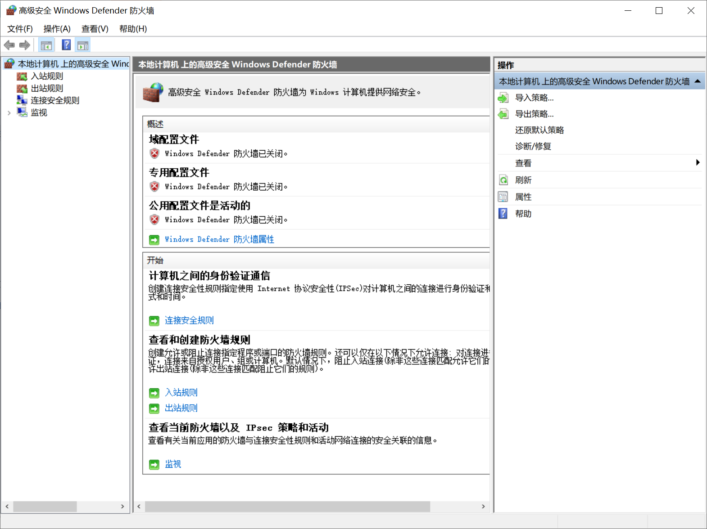
* 点击左侧的"入站规则"，然后点击右侧的"新建规则"
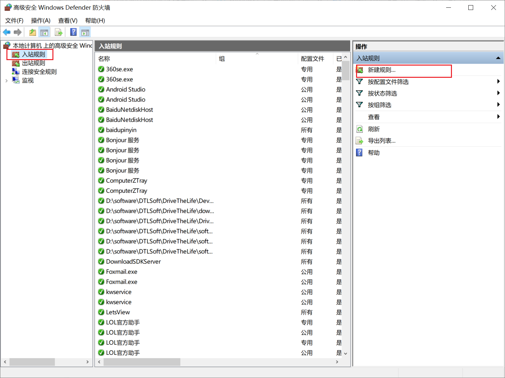
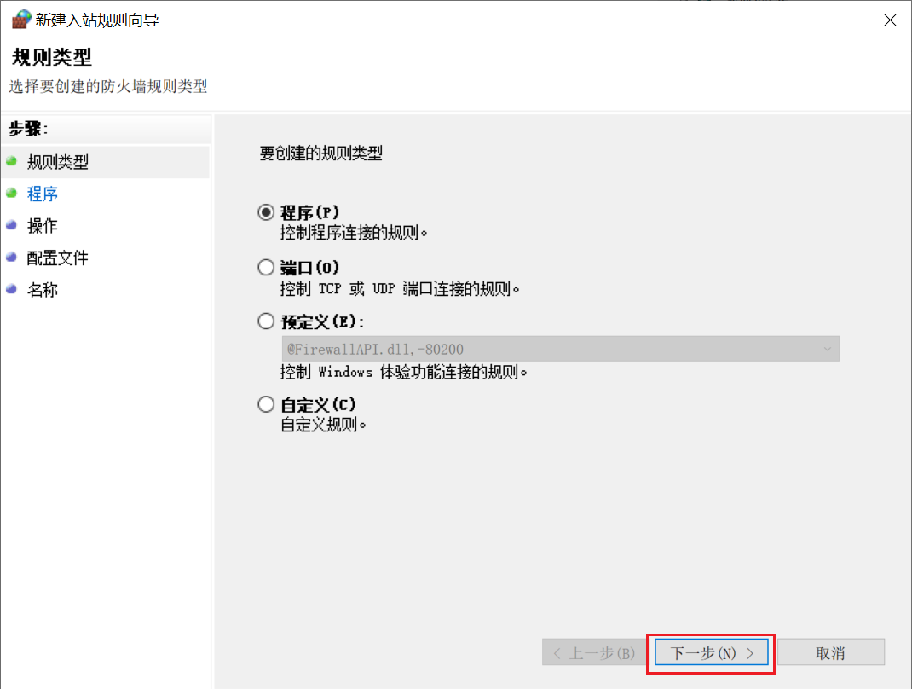
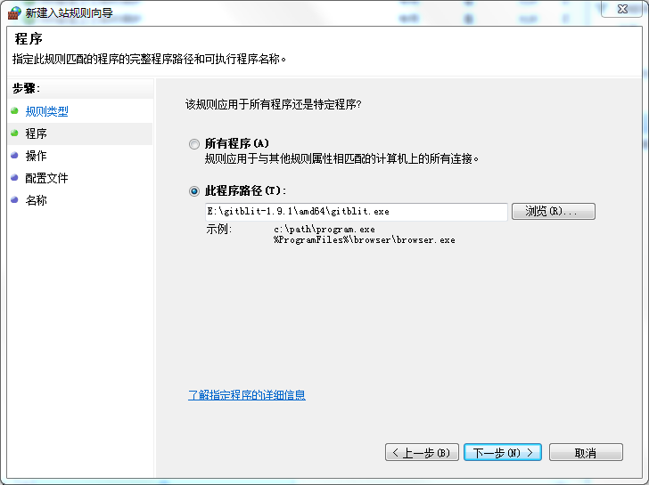
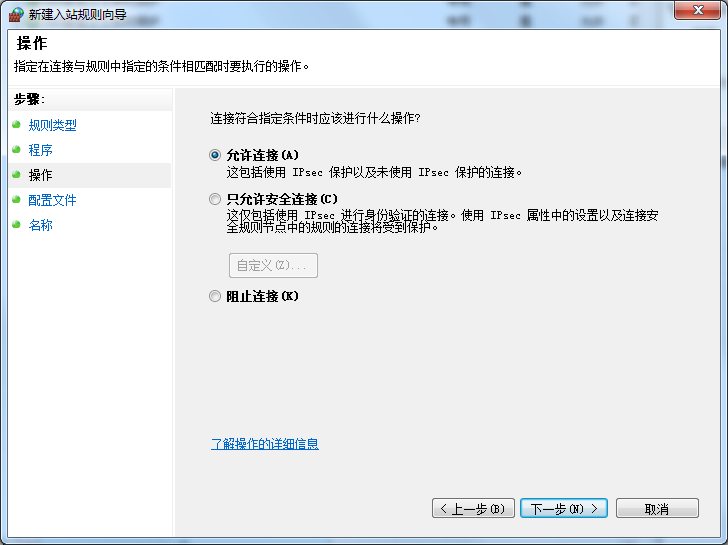
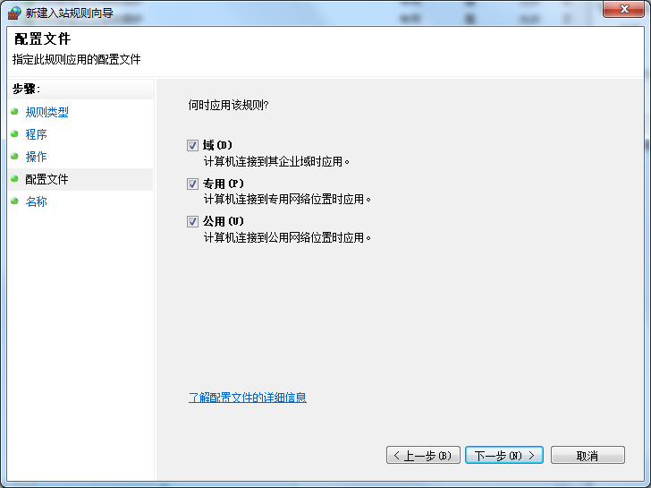
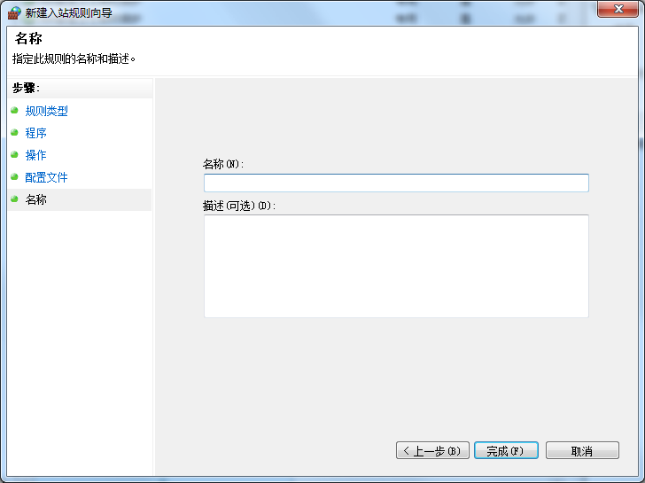
* 名称随便填写，最后点击完成即可；
