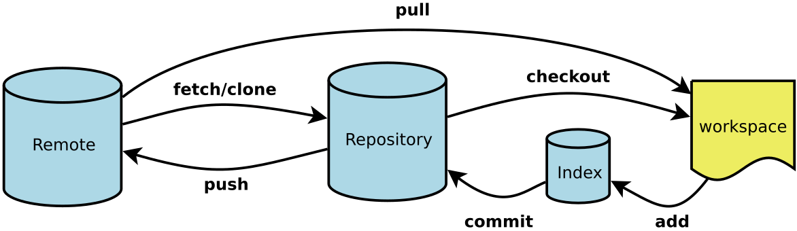

#Git常用命令
* git for windows
  https://gitforwindows.org/
* 目前git服务器地址
  http://192.168.4.139:8686/
* git构架

* 新建代码仓(本地)
``` shell
#初始化git
git init
#提交本地文件到git缓存区
git add --all
#将缓存区的文件提交到本地
git commit -am "初始化版本"
```
* 关联远程仓库
``` shell
#查看当前远程仓库地址
git remote -v
#移除当前远程仓库地址
git remote remove
#添加远程仓库的地址
git remote add origin http://eric@192.168.4.139:8686/r/ly_git_test.git
```
* 克隆远程仓库代码
``` shell
git clone http://eric@192.168.4.139:8686/r/ly_git_test.git
```
* 查看修改记录文件
``` shell
git status
```
* 查看修改文件的内容
``` shell
git diff 1.txt
```
* 提交修改文件
``` shell
git add 1.txt
```
* 查看提交记录
``` shell
git log
```
* 撤回本地提交
``` shell
#撤回本地最近一次的提交记录；
git reset --soft HEAD^
#从缓存区中撤回来
git reset HEAD
```
* 撤销本地的修改记录
``` shell
git checkout 1.txt
```
* 撤销本地所有修改记录
``` shell
git add --all && git reset --hard
```
* 同步服务器最新节点
``` shell
git fetch
git pull origin master
```
* git 中文显示乱码的问题
``` shell
git config --global core.quotepath false
```
* 更多命令
https://blog.csdn.net/fromatozhappy/article/details/113527359
