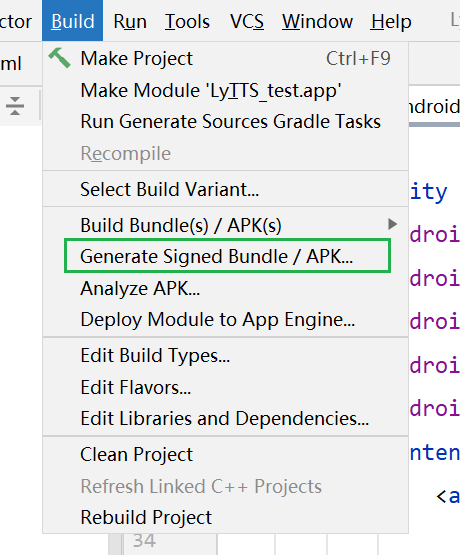
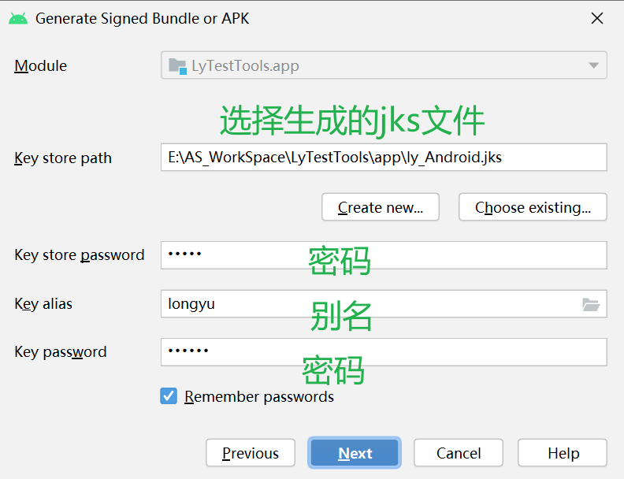
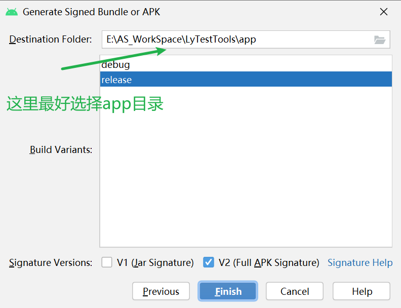
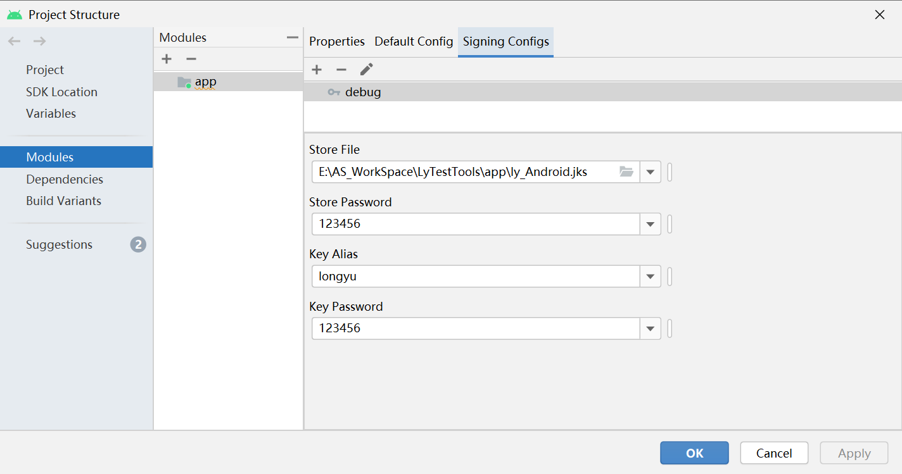
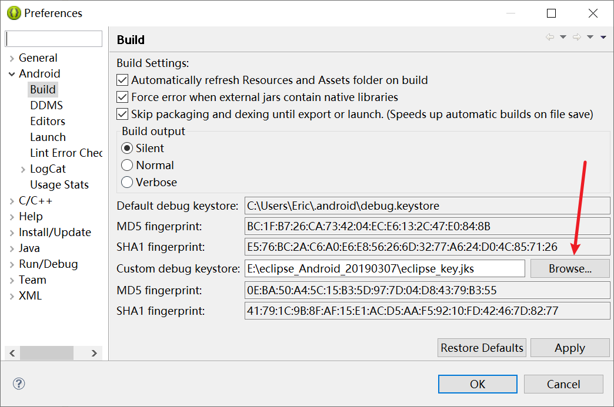

#Android 签名文件
##如何生成签名jks文件
####1.签名所需文件
``` shell
build/target/product/security/目录下
```
####2.生成 platform.pem
``` shell
openssl pkcs8 -inform DER -nocrypt -in platform.pk8 -out platform.pem
```
####3.生成platform.p12文件，并设置别名(longyu)和密码(123456)
``` shell
openssl pkcs12 -export -in  platform.x509.pem -out platform.p12 -inkey  platform.pem -password pass:123456 -name longyu
```
####4.生成platform.jks文件 (密码：123456)
``` shell
keytool -importkeystore -deststorepass 123456 -destkeystore ./platform.jks -srckeystore ./platform.p12 -srcstoretype PKCS12 -srcstorepass 123456
```
##Android Studio如何使用jks文件




###AS debug使用签名文件

app目录下的build.gradle自动生成如下:
``` java
android {
    signingConfigs {
        debug {
            storeFile file('E:\\AS_WorkSpace\\LyTestTools\\app\\ly_Android.jks')
            storePassword '123456'
            keyAlias 'longyu'
            keyPassword '123456'
        }
    }
    ......
}
```
##Android 手动签名APK
####1.签名命令参数解析
``` shell
java -jar apksigner.jar sign --ks xxx.jks --ks-key-alias xxx --ks-pass
 pass:xxxx --key-pass pass:xxxx --out output.apk moa.apk

java -jar apksigner.jar sign            //执行签名操作
--ks 你的jks路径                        //jks签名证书路径
--ks-key-alias 你的alias                //生成jks时指定的alias
--ks-pass pass:你的密码                 //KeyStore密码
--key-pass pass:你的密码                //签署者的密码，
即生成jks时指定alias对应的密码
--out output.apk                        //输出路径
input.apk                               //被签名的apk
```
####2.查看签名状态
``` shell
java -jar apksigner.jar verify -v output.apk
注: apksigner.jar文件在api >= 25 SDK/build-tools/30.0.3/lib中,我这里是30的api;
```

###Eclipse上使用JKS签名文件
``` shell
则生成信息需要修改如下
别名：androiddebugkey
密码：android
别名密码：android
保证跟eclipse默认的签名信息保证一致即可
```

