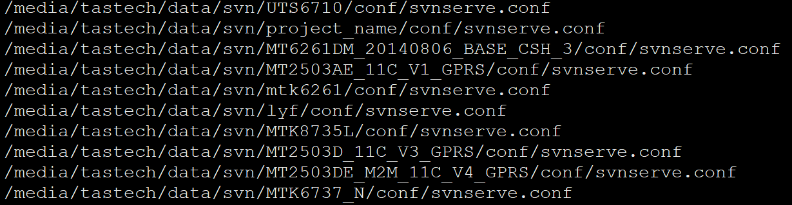
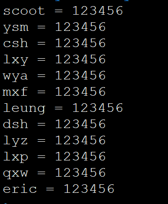

###Ubuntu 添加svn用户
#####登录svn服务器，帐号如下：
    服务器地址：192.168.12.7
    服务器账号密码：tastech  123456
####svn配置文件
* 查找svn配置文件目录
``` shell
find /media/ -name "svnserve.conf"
```

* 找到对应的项目目录修改文件
``` shell
cd /media/tastech/data/svn/MT8765_O/conf
vim authz
修改，在末尾添加用户名即可；
group_users = eric
保存退出
vim passwd
添加用户名密码，保存退出；
```

现在可以使用添加的用户了。
