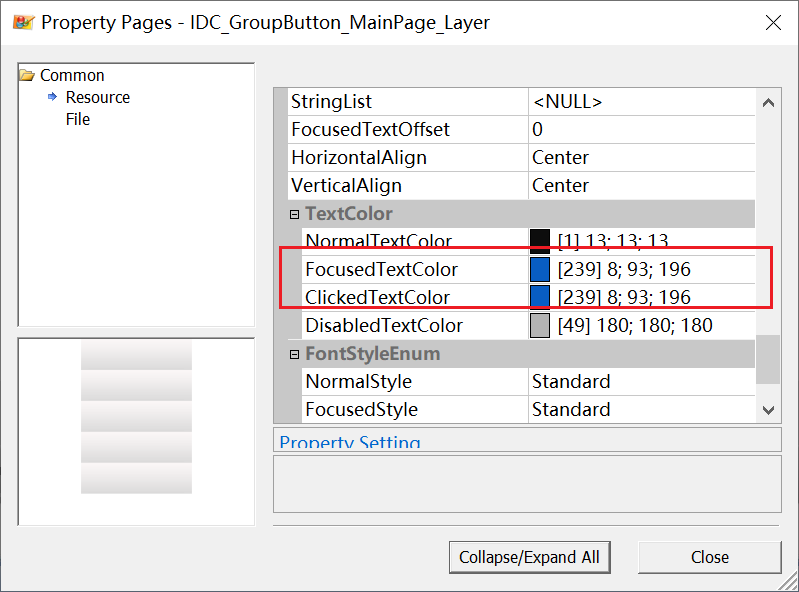

###个人笔记
平台：展讯UST6710
####编译：

1. 执行脚本prjmk
     ./prjmk  选择1
    酷乐视项目选择COOLUX分支
2.	uiDesign工具分别打开TV_UIProject和FilePlayer_UIProject，并Generation

3.	make clean && make all

4.	编译失败需要执行(不需要修改内容)
		make menuconfig
		make boardconfig

####烧录：
    U盘：
		拷贝生成的mergedir/UTS_6710.code.bin到U盘，插入U盘，点击设备中的---Settings--->Setup--->Software Upgrade(点击确认)，
		等待检查升级成功，机器灭屏，拔掉U盘，重新上电开机即可。

####指导网址：
	https://unisupport.unisoc.com/tool/index
	帐号： caojie
	密码：qwertyuiop
####界面编译
    TV.uiprj 		  输出resources  \UTS6710\aps\application\s2tek\formal\resources
    FilePlayer.uiprj  输出resources  \UTS6710\aps\application\s2tek\formal\media\resources
* 查看图片的ID：
\UTS6710_Liunx\UTS6710\aps\application\s2tek\formal\resources\include\TV_bitmap_config.h

* 更新图片：
```  _APP_GUIOBJ_MainMenu_UpdataIcon(图片ID)```
* 更改字体颜色：
  
