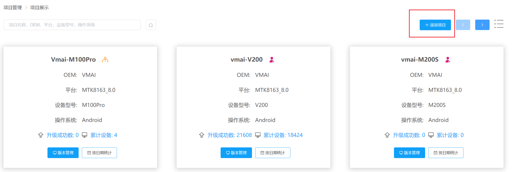
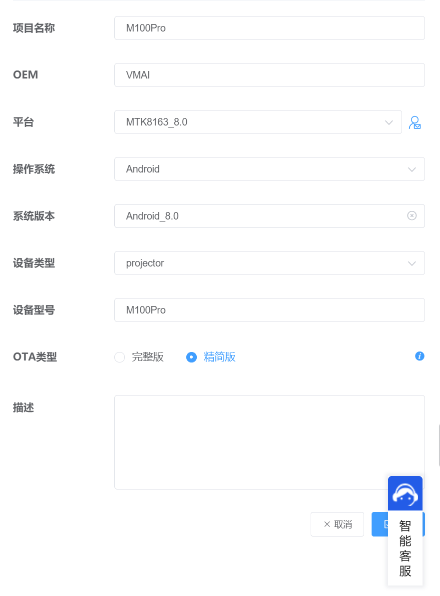
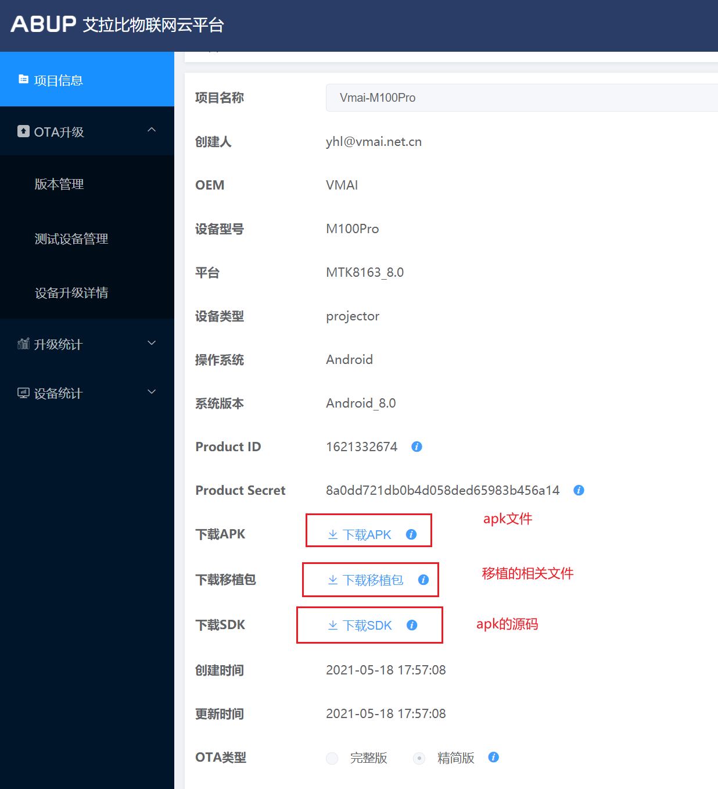
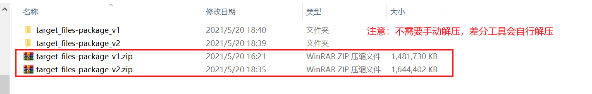
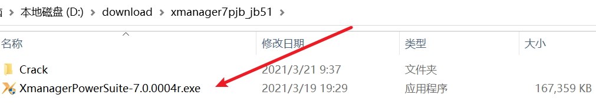
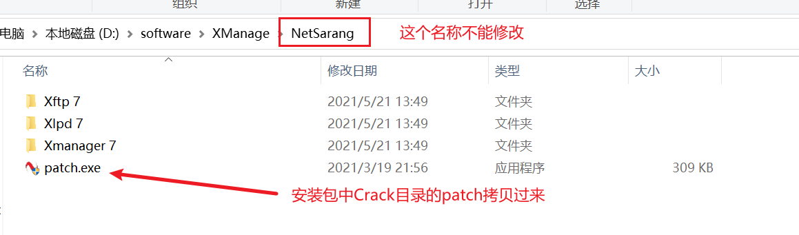
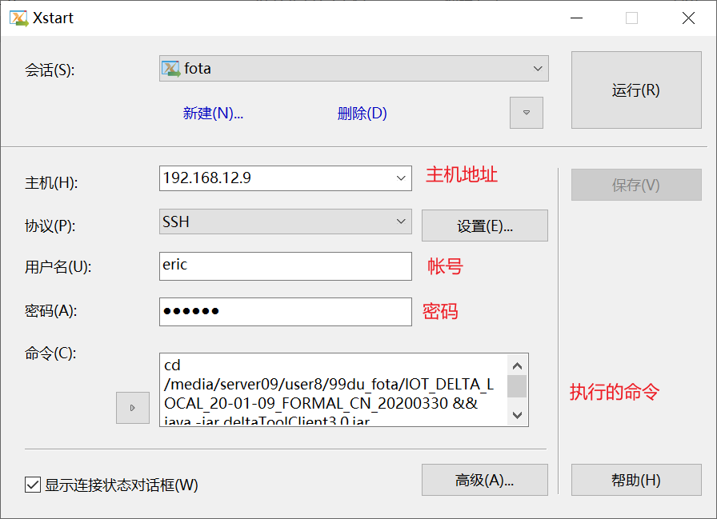
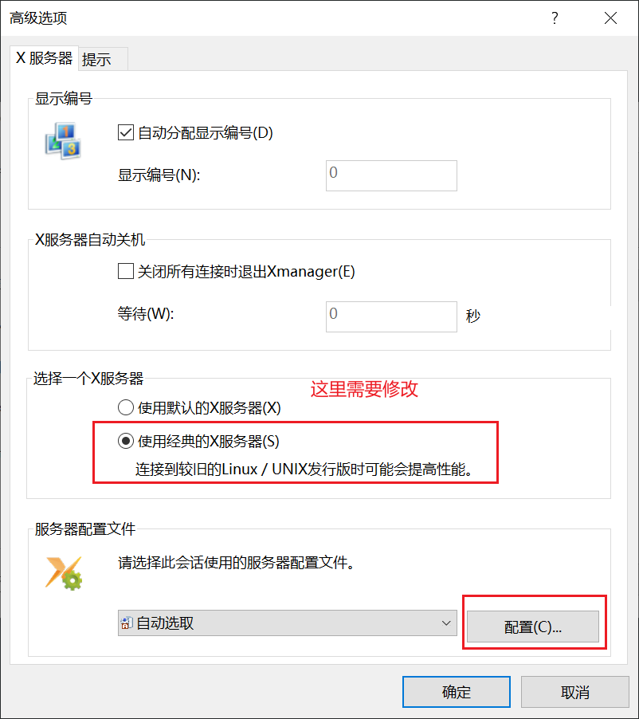
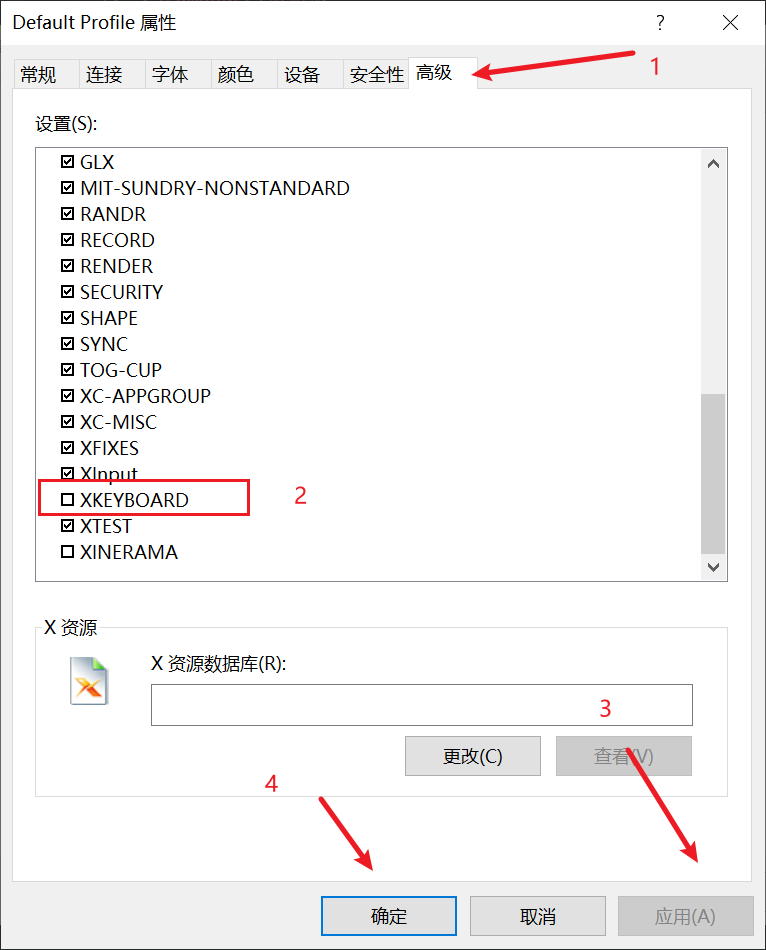
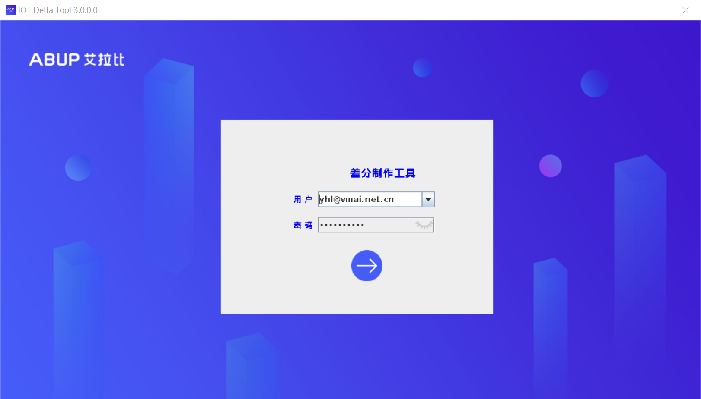

###fota艾拉比
  微麦客户是自己找的无线升级供应商，叫abupdate，中文名艾拉比，此升级服务实际上也是从广升体系出来的，账户由微麦客户提供。
###登录fota的网址，建立相应的项目：
  	网址：	 http://iotmg.abupdate.com/ProjectHome
  	用户名：  yhl@vmai.net.cn
  	密码：	 vmai123456




###移植对应的补丁以及apk到Android源码中
* 软件参考对应的补丁
* 添加Abupdate apk文件到系统中
###编译ota的固件
``` shell
make -j12 && make otapackage
```
out目录下会生成 target_files-package.zip 文件，理解为初始版本。
###差分步骤
```
#重命名初始化版本
mv target_files-package.zip target_files-package_v1.zip

#修改对应的文件，例如MyTvSettings_vmai
make -12 && make otapackage

#out目录下会生成新的target_files-package.zip 文件，重命名为target_files-package_v2.zip
mv target_files-package.zip target_files-package_v2.zip

拷贝到指定的samba服务器地址：
地址：\\192.168.12.9\user8\99du_fota\IOT_DELTA_LOCAL_20-01-09_FORMAL_CN_20200330
```

#####这里介绍两种运行差分工具的办法
* 利用Xmanage7 直接运行差分的jar文件
  1. 安装Xmanage7破解版

  2.  安装的目录自行选择，目录名称要如下截图，否则破解不了，拷贝安装包中Crack中的patch文件

  3. 右击已管理员的身份运行，破解就成功了。
  4. 桌面上会有Xmanager Power Suite 7文件夹tools目录下有Xstart，如果未生成，在安装的目录Xmanage7中找到Xstart.exe
  5. 点击运行Xstart.exe，配置如下，这里用的是eric帐号，密码123456，也可以用自己的帐号登录。命令如下：
  ```
   cd  /media/server09/user8/99du_fota/IOT_DELTA_LOCAL_20-01-09_FORMAL_CN_20200330 && java -jar deltaToolClient3.0.jar
  ```
  
  6. 这个时候运行还不行，还需要继续配置一下。点击高级，出现如下图修改，继续点击配置--高级--修改如图
  
  
  7. 关闭程序，重启运行成功。
  
* 利用ubuntu虚拟机来操作，缺点是需要安装虚拟机，目前在ysm台式电脑中有安装。
```
    samba服务器地址：192.168.13.232
    帐号：ysm
    密码：123456
```
  1. 利用该帐号登录ubuntu虚拟机的samba，拷贝差分的文件到samba的目录。
  2. 打开虚拟机，运行终端(Alt+Ctrl+T), 运行下面两条指令，差分工具运行成功。
  ```
  cd IOT_DELTA_LOCAL_20-01-09_FORMAL_CN/
  java -jar deltaToolClient3.0.jar
  ```
* 开始差分部署固件
